# 《计算机网络》实验二：IP 和 TCP 数据分组的捕获和解析

# 目录

[TOC]

<!-- 注释语句：导出PDF时会在这里分页 -->

## 实验内容和实验环境描述

### 实验内容

​	本次实验内容：

1. 捕获在使用网络过程中产生的分组（packet）：  IP 数据包、ICMP 报文、DHCP 报文、TCP 报文段；
2. 分析各种分组的格式，说明各种分组在建立网络连接和通信过程中的作用；
3. 分析 IP 数据报分片的结构：理解长度大于 1500 字节 IP 数据报分片传输的结构；
4. 分析 TCP 建立连接、拆除连接和数据通信的过程；

​	个人拓展研究内容：

1. 捕获并分析 ARP 报文及协议；
2. 捕获并分析 IPv6 数据包及协议；
3. 捕获并分析 HTTP 报文及协议；
4. 一些与教学内容不符的实际工作情况分析：包括 IPv6 和 IPv4 混用、TCP “三次挥手”等；

### 实验环境描述

​	本实验我在个人的 MacBook Air 笔记本上完成，macOS 系统自带的“系统信息”工具可以快捷地查看各项参数。

<center><strong>表 1.1 实验环境</strong></center>

| 配置项          | 参数                   |
| --------------- | ---------------------- |
| 操作系统        | macOS Sequoia 15.4     |
| CPU             | Apple M3               |
| 内存            | LPDDR5 16GB            |
| 网卡            | Wi-Fi (0x14E4, 0x4388) |
| 支持 PHY        | 802.11 a/b/g/n/ac/ax   |
| Wireshark       | Version 4.4.6          |
| iTerm2 Terminal | Build 3.5.3            |

​	从 Apple M3 开始，苹果终于开始支持 WIFI 6E，即 802.11ax@160MHz 。


## 实验步骤和协议分析

### 实验准备

​	Wireshark 是免费的网络协议分析软件，能够捕获网络中传输的数据，并按照协议进行解析，显示出各字段的值。该软件广泛地应用于网络协议的学习、分析、开发和查错。本实验采用 Wireshark 软件进行抓包和协议分析。

（1）下载并安装 Wireshark 4.4.6 Arm64 ；

（2）启动 Wireshark，选择正确的接口 en0，准备捕获协议数据；

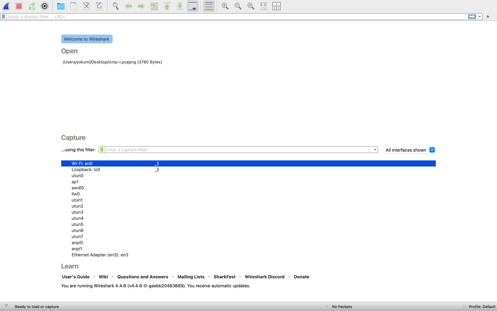

<center><strong>图 2.1 Wireshark 启动界面</strong></center>


### 捕获和分析 DHCP 报文

#### 适配 macOS 系统的操作

​	由于 macOS 系统并没有内建的 DHCP Client，并无法执行像 Windows 中 `ipconfig /release` 一样 DHCP 级的操作，该操作的作用是清除当前的 DHCP 配置（包括 IP 地址、网关、DNS 等），接口进入“未配置”状态，但是网卡仍为启用状态。

​	一开始考虑在使用命令：`sudo ifconfig en0 down`，但该命令事实上直接关闭了网络接口（macOS 系统下，en0 接口对应的就是 WIFI ），不会走 DHCP 客户端并向 DHCP Server 发送 Release 包，与实验要求并不完全一致。解决方案有以下 2 种：

1. 使用 `sudo ipconfig set en0 DHCP` 命令，该命令的作用是重新获取 DHCP IP 地址，但与 Windows 操作系统的区别是它此时执行了释放 + 重新获取，并不是像实验指导书一样分两步，不过结果一致；
2. 使用 **dhclient** 操作 DHCP；

​	有关 **dhclient** 的介绍如下：

​	dhclient 是 ISC（Internet Systems Consortium）DHCP 客户端程序，用于通过 DHCP 协议自动获取网络配置，它是 Linux 和 Unix-like 系统（如 macOS 系统）中常用的 DHCP 客户端，不过 macOS 默认并未安装。使用步骤如下：

1. 安装 dhclient：`brew install isc-dhcp`；
2. 执行命令：`sudo dhclient -r en0`，`-r` 表示释放连接；
3. 执行命令：`sudo dhclient en0`，重新申请 IP 地址；

​	需要注意的是，isc-dhcp 已被 Homebrew 官方弃用（不再维护），所以推荐使用方法 1。


#### 捕获方法及过程

1. **设置捕获条件**：在捕获过滤器中进行如下设置：`udp port 67`；

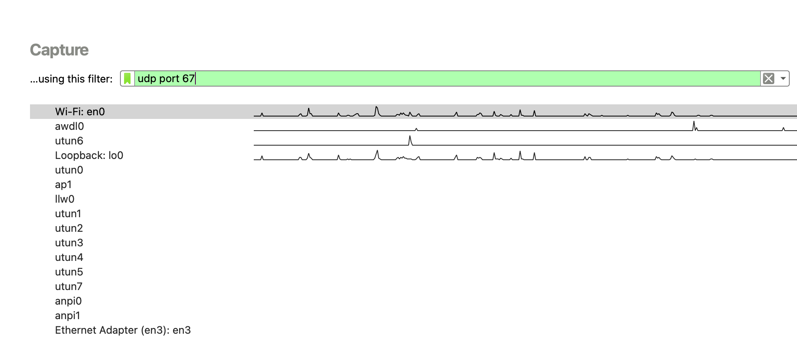

<center><strong>图 2.2 Wireshark 捕获器设置</strong></center>

2. **开始捕获**：按下左上角的 `Start Capturing packets` 清空捕获记录并重新开始捕获；
3. **释放主机的 IP 地址并重新获取**：使用 iTerm2 终端，运行 `sudo ipconfig set en0 DHCP`，释放主机 IP 地址，断网，再重新获取 IP 地址；
4. 观察 Wireshark，捕获到以下数据包：

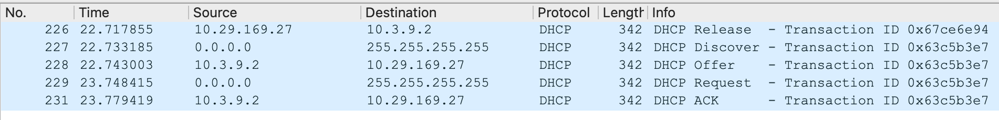

<center><strong>图 2.3 捕获到的 DHCP 消息</strong></center>

5. **保存捕获内容**：选中 5 条消息，保存至 `dhcp.pcapng` ；
6. 如果通过筛选器而不是捕获器设置条件，还可以查看同一次操作中的 Arp 消息，结果如下：


<center><strong>图 2.4 捕获到的 ARP 消息</strong></center>

7. 同样将 arp 消息保存至 `arp.pcapng` ；

#### DHCP 协议分析

##### 协议简介

​	DHCP协议，全称 Dynamic Host Configuration Protocol ，即动态主机配置协议。简单来说，在没有 DHCP 协议时，网络管理员需要手动配置这些信息，但是 DHCP 使得在一台主机接入网络后，系统会自动给其分配一个 IP 地址（并保证不冲突）并告知其默认网关、DNS 服务器等信息。另外，它还提供**租赁 Leasing** 和 **续租 Renewal** 服务，即 IP 地址的使用时间是有限的，需要配置租期（多长时间使用这个 IP 地址）；该协议属于**应用层协议**。

##### 端口分析

​	DHCP 协议用来提供自动配置的 IP 地址和其他有关的配置信息（网关、网络掩码、DNS 服务器和文件服务器等等）给网络中的其他主机，并使用 **UDP** 携带该消息；同时，规定：

* **服务器 使用 UDP 67 端口进行监听**；
* **客户端使用 UDP 68 端口进行监听**；

​	即，当客户端设备需要 IP 地址或其他网络配置信息时，它会通过 UDP 端口 68 向 DHCP 服 务器发送请求；当 DHCP 服务器接收到客户端的请求后，它会通过 UDP 端口 67 发送包含 IP 地址 和网络配置信息的响应。

​	实验中，使用 `udp port 67` 捕获 DHCP 消息，需要注意的是，**Wireshark 的端口过滤器是双向匹配的**，即 `udp port 67` 会匹配：

- udp src port 67
- udp dst port 67

​	所以实验中，我们捕获到了客户端和服务端之间通信的完整消息。

##### DHCP 协议的主要数据包

1. **Discover 发现**：客户端广播寻找 DHCP 服务器；
2. **Offer 提供**：服务器收到 DISCOVER 包之后向客户端发送的响应数据包，它包括了给予客户端的 IP 、客户端的 MAC 地址、租约过期时间、服务器的识别符以及其他必要信息；
3. **Request 请求**：上一步中 DHCP Server 提供的 Offer 可能有多个，或者可能存在多个 DHCP Server，客户端选择一个 Offer 并请求使用；
4. **Ack 确认**：当 DHCP 服务器接收到 REQUEST 包后，如果同意分配请求的 IP 地址，它会发送一个 ACK 包，确认分配的 IP 地址和网络配置信息，正式分配 IP 地址等配置信息；

​	以上是关键的几种，除此之外，在查阅资料^[1]^，还有以下几种类型：

5. **DECLINE**：如果客户端发现分配的 IP 地址已经被使用，或者配置信息有问题，它会发送一个 DECLINE 包，拒绝接受该地址，并期望获得新的 IP 地址；
6. **NAK**：如果 DHCP 服务器无法满足客户端的请求，比如，如果请求的 IP 地址已经被占用，它会发送一个 NAK 包，表示请求失败；
7. **RELEASE**：一般出现在客户端关机、下线等情况下，该报文将会使 DHCP 服务器释放发出此报文的客户端的 IP 地址；

##### 协议基本工作流程

```
客户端                         DHCP服务器
   | --------Discover----------> |
   | <---------Offer------------ |
   | --------Request-----------> |
   | <--------ACKnowledge------- |
```

​	客户端在局域网内发送一个 Discover 包，希望发现 DHCP Server 。可用的 DHCP Server 在收到 DHCP Discover 包后，通过发送 Offer 包给予客户端应答，从而告诉客户端它可以提供 IP 地址。客户端在收到 Offer 包后，发送DHCP Request 包到 DHCP Server 从而请求分配 IP 。服务器在收到 Request 包后，向客户端发送 ACK 数据包，正式分配该 IP 地址给客户端。

​	需要注意的是，再未被正确分配 IP 之前，客户端只有 MAC 地址，只能在本子网内传播，无法跨路由器，如果 DHCP Server 不在本局域网内，则需要通过 DHCP Relay Agent 进行中继代理，简单来说，DHCP Relay 收到 Discover，记住客户端的原始 IP ，并将请求以单播方式转发给 DHCP Server，然后将 DHCP Server 的回复转发给客户端；

##### DHCP 报文格式

```
0         7            15        23       31
+------------------------------------------+
|  Op(1)  |  Htype(1)  | Hlen(1) | Hops(1) |
+------------------------------------------|
|                    Xid(4)                |
+------------------------------------------|
|        Secs(2)      |      Flags(2)      |
+------------------------------------------|
|                 Ciaddr(4)                |
+------------------------------------------|
|                 Yiaddr(4)                |
+------------------------------------------|
|                 Siaddr(4)                |
+------------------------------------------|
|                 Giaddr(4)                |
+------------------------------------------+
|                 Chaddr(16)               |
+------------------------------------------+
|                 Sname(64)                |
+------------------------------------------|
|                 File(128)                |
+------------------------------------------+
|           Options(variable)              |
+------------------------------------------+
```

​	其中，各字段的基本含义^[2]^如下：

* **Op**：报文类型
  * 1：客户端请求报文；
  * 2：服务端响应报文；
* **Htype**：硬件类型
  * 不同的硬件类型取值不同，最常见的值是 1 ，表示以太网；
* **Hlen**：硬件地址长度，即 MAC 地址长度
  * 对于以太网，Hlen = 6 ；
* **Hops**：跳数，即当前报文经过 DHCP Relay 的数目
* **Xid**：事务 ID，由客户端选择的一个随机数，被服务器和客户端用来在它们之间交流请求和响应，客户端用它对请求和应答进行匹配
  * 该 ID 由客户端设置并由服务器返回，为 32 位整数；
* **Secs**：表示客户端从开始获取地址或地址续租更新后所用的时间（单位：秒）
* **Flags**：此字段在 BOOTP 中保留未用，在 DHCP 中表示标志字段
  * 只有标志字段的最高位才有意义，其余的位均被置为 0 ；
  * 最左边的字段被解释为广播响应标志位：
    * 0：客户端请求服务器以单播形式发送响应报文；
    * 1：客户端请求服务器以广播形式发送响应报文；
* **Ciaddr**：客户端的 IPv4 地址
  * 仅当服务器确认 IP 地址时被填充；
* **Yiaddr**：服务器分配给客户端的 IPv4 地址
  * 在服务器发送的 Offer 和 ACK 报文中显示；
* **Siaddr**：DHCP 协议流程的下一个阶段要使用的服务器的 IPv4 地址
  * 注意其并不等于 DHCP Server 的地址；
* **Giaddr**：第一个经过的 DHCP  Relay 的 IPv4 地址
  * 如果没有经过中继则为0；
* **Chaddr**：客户端的 MAC 地址；
* **Sname**：客户端获取 IP 地址等配置信息的服务器名称（ DNS 域名格式）
  * 由 DHCP Server 填写，仅在 Offer 和 ACK 报文中显示，其余为 0 ；
* **File**：客户端的启动配置文件名称及路径信息
  * 由 DHCP Server 填写；
* **Options**：DHCP 的选项字段
  * 至少为 312 字节，格式为“代码 + 长度 + 数据”；
  * DHCP 消息中 option 字段的首 4 个字节的值分别为 63H、82H、53H 和 63H ，这是标准协议中定义的 magic cookie ；
  * DHCP 通过此字段包含了服务器分配给终端的配置信息，如网关 IPv4 地址，DNS 服务器的 IPv4 地址，客户端可以使用 IPv4 地址的有效租期等信息；

#### 捕获报文分析

​	这部分，我将结合抓包结果，对 DHCP 协议进行具体分析：

1. 释放 IP  地址时，发送了一个长度为 342 Bytes 的 Release 包，包的内容如下：

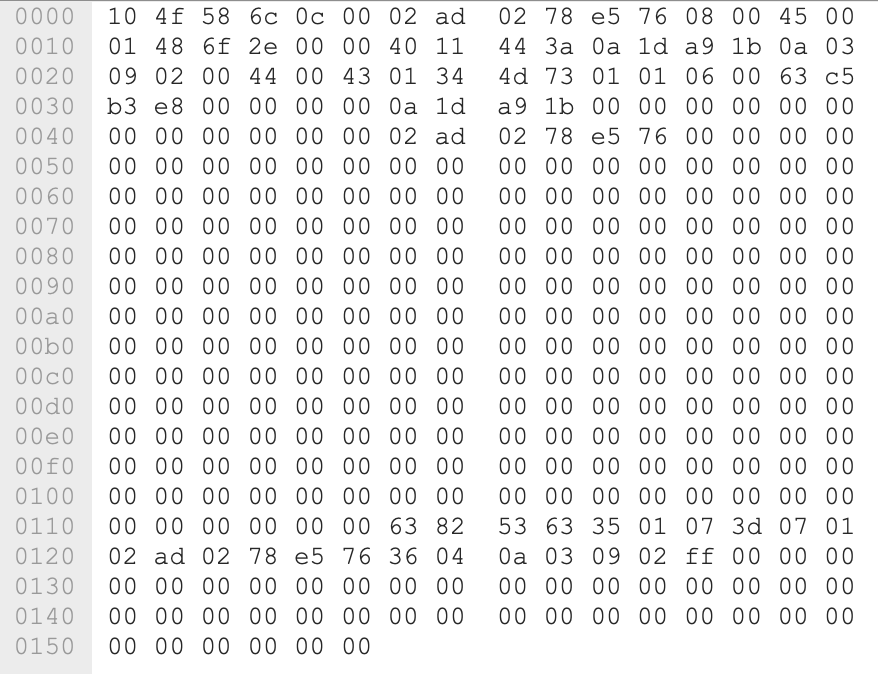

<center><strong>图 2.5 Release 包内容</strong></center>

​	Wireshark 软件可以快捷地解析出对应字段的内容（字段的命名和我稍有区别，不过无影响），方便分析：

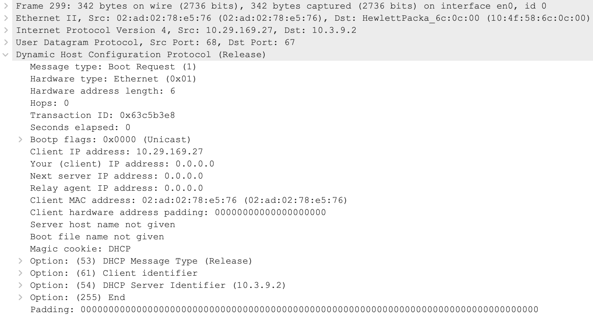

<center><strong>图 2.6 Release 包解析结果</strong></center>

​	我对部分较为重要的字段的内容进行了注释，如 表 2 - 1 所示：

<center><strong>表 2.1 Release 包字段注释</strong></center>

| 字段         | 值                      | 注释                                                         |
| ------------ | ----------------------- | ------------------------------------------------------------ |
| Op           | 1                       | 客户端请求报文                                               |
| Htype        | 1                       | 以太网                                                       |
| Hlen         | 6                       | 以太网 MAC 地址长度                                          |
| Xid          | 0x63c5b3e8              | 事件标识符                                                   |
| Flags        | 0                       | 客户端请求服务器以单播形式发送响应报文                       |
| Ciaddr       | 10.29.169.27            | 我的当前本机 IP                                              |
| Yiaddr       | 0.0.0.0                 | 表明本机 IP 将要被释放                                       |
| Siaddr       | 0.0.0.0                 |                                                              |
| Giaddr       | 0.0.0.0                 | 没有通过 DHCP Relay，即直接与DHCP Server 通信                |
| Chaddr       | 02:ad:02:78:e5:76       | 我的本机 MAC 地址                                            |
| Magic cookie | DHCP                    | 即 option 字段的前 4 字节                                    |
| Option(53)   | DHCP Release            | 指明该数据包为 Release 请求                                  |
| Option(54)   | 10.3.9.2                | DHCP Server 的 IP 地址                                       |
| Option(61)   | 07 01 02 ad 02 78 e5 76 | 客户端（本机）的标识信息（本机 MAC 地址为 02:ad:02:78:e5:76） |

​	Option(53)  指明了该消息类型为 DHCP Release ，该消息是由客户端（即本机）发送给 DHCP Server 的（这一点从 Op 字段可以得到印证），用于通知服务器客户端不再需要之前分配的 IP 地址，并请求服务器将该 IP 地址从其分配池中释放。Xid（0x63c5b3e8）用于客户端与服务器之前跟踪请求和响应，确保消息的正确匹配。Option(54) 和 Option(61) 分别指明了服务器和客户端的标识信息，用于确保消息被正确地路由和处理。

2. 重新申请分配  IP  地址时，依次捕获到 Discover 、Offer 、Request 、ACK 四个 DHCP 报文，符合 2.2.3.4 节 协议基本工作流程。具体分析如下：

​	首先，DHCP Discover 消息是由客户端（本机）在网络中广播发送的，用于寻找可用的 DHCP 服务器，其报文内容和解析结果如图 2.7 和图 2.8 所示：

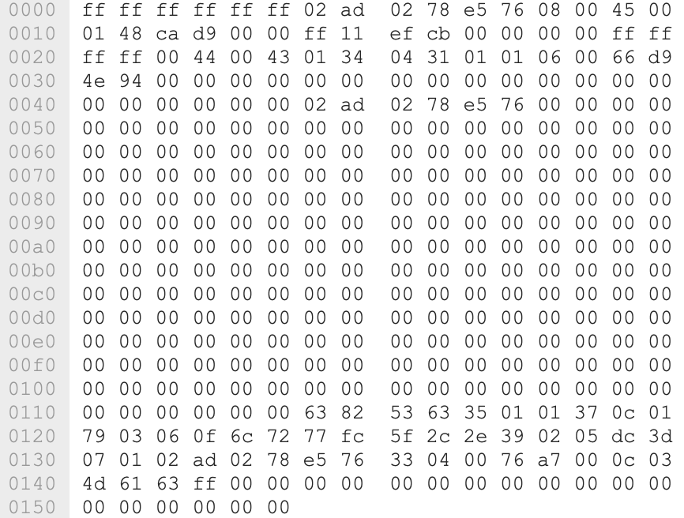

<center><strong>图 2.7 Discover 包内容</strong></center>

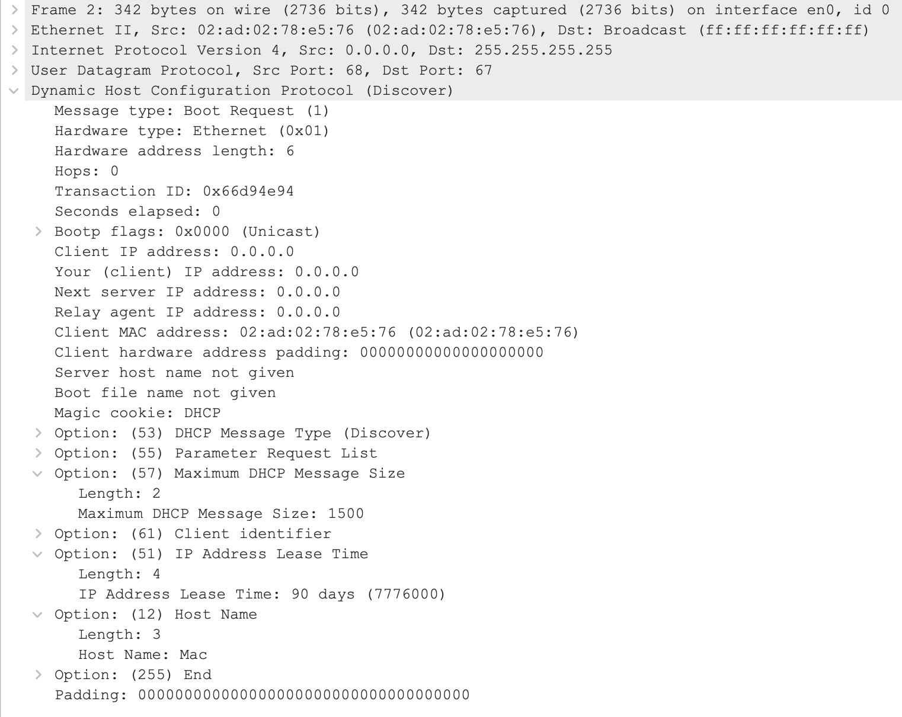

<center><strong>图 2.8 Discover 包解析结果</strong></center>

​	我对部分较为重要的字段的内容进行了注释，如 表 2 - 2 所示：

<center><strong>表 2.2 Discover 包字段注释</strong></center>

| 字段         | 值                             | 注释                                   |
| ------------ | ------------------------------ | -------------------------------------- |
| Op           | 1                              | 客户端请求报文                         |
| Htype        | 1                              | 以太网                                 |
| Hlen         | 6                              | 以太网 MAC 地址长度                    |
| Xid          | 0x66d94e94                     | 事件标识符                             |
| Flags        | 0                              | 客户端请求服务器以单播形式发送响应报文 |
| Ciaddr       | 0.0.0.0                        | 客户端尚未分配 IP 地址                 |
| Yiaddr       | 0.0.0.0                        |                                        |
| Siaddr       | 0.0.0.0                        |                                        |
| Giaddr       | 0.0.0.0                        | 试图直接与 DHCP 服务器通信             |
| Chaddr       | 02:ad:02:78:e5:76              | 我的本机 MAC 地址                      |
| Magic cookie | DHCP                           | 即 option 字段的前 4 字节              |
| Option(53)   | DHCP Discover                  | 指明该数据包为 Discover 请求           |
| Option(55)   | 子网掩码、路由器、域名服务器等 | 请求参数列表                           |
| Option(61)   | 07 01 02 ad 02 78 e5 76        | 客户端（本机）的标识信息               |
| Option(51)   | 33 04 00 76 a7 00              | 期望申请的租赁时间（90天）             |
| Option(12)   | Mac                            | 客户端（本机）名称                     |

​	Option(53) 指示了消息类型为 DHCP Discover 。客户端还没有分配到 IP 地址， 因此它的 IP 地址字段设置为 0.0.0.0。Xid（0x66d94e94）用于跟踪请求和响应，确保消息的正确匹配。Option(61)  提供了客户端的标识信息，Option(12) 提供了客户端的主机名称，Option(55) 列出了客户端请求的参数。这些信息帮助 DHCP 服务器响应客户端的请求，并提供客户端所需的网络配置信息。

​	当收到 DHCP Discover 报文后，服务器发送一个 DHCP Offer 报文，用于提供可供客户端使用的 IP 地址和其他网络配置信息。其报文内容和解析结果如图 2.9 和图 2.10 所示：

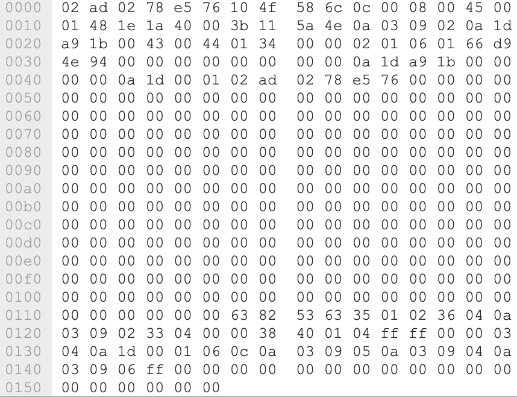

<center><strong>图 2.9 Offer 包内容</strong></center>

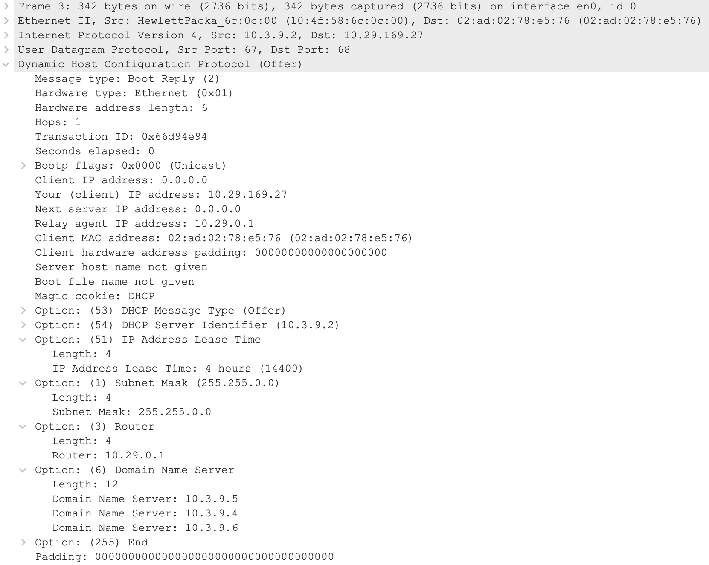

<center><strong>图 2.10 Offer 包解析结果</strong></center>

​	我对部分较为重要的字段的内容进行了注释，如 表 2 - 3 所示：

<center><strong>表 2.3 Offer 包字段注释</strong></center>

| 字段         | 值                | 注释                                                      |
| ------------ | ----------------- | --------------------------------------------------------- |
| Op           | 2                 | 服务端响应报文                                            |
| Htype        | 1                 | 以太网                                                    |
| Hlen         | 6                 | 以太网 MAC 地址长度                                       |
| Hops         | 1                 | 经过了 1 个 DHCP Relay                                    |
| Xid          | 0x66d94e94        | 事件标识符，与之前一致                                    |
| Flags        | 0                 | 服务器以单播形式发送响应报文                              |
| Ciaddr       | 0.0.0.0           | 客户端尚未分配 IP 地址                                    |
| Yiaddr       | 10.29.169.27      | 可供客户端使用的 IP                                       |
| Siaddr       | 0.0.0.0           |                                                           |
| Giaddr       | 10.29.0.1         | 说明 DHCP Server 与主机不在一个网段（网关 IP：10.29.0.1） |
| Chaddr       | 02:ad:02:78:e5:76 | 我的本机 MAC 地址                                         |
| Magic cookie | DHCP              | 即 option 字段的前 4 字节                                 |
| Option(53)   | DHCP Offer        | 指明该数据包为 Offer 响应                                 |
| Option(54)   | 10.3.9.2          | DHCP Server 的 IP 地址                                    |
| Option(51)   | 33 04 00 00 38 40 | 租约期限（4小时）                                         |
| Option(1)    | 255.255.0.0       | 子网掩码（说明该网段为 B 类网络）                         |
| Option(3)    | 10.29.0.1         | 网关 IP                                                   |
| Option(6)    | 10.3.9.5等        | 可用的 DNS 服务器 IP                                      |

​	Option(53) 指示了消息类型为 DHCP Offer ，该消息是由服务器发送给客户端的，用于提供可供客户端使用的 IP 地址和其他网络配置信息。Xid（0x1aaaba29）用于跟踪请求和响应，确保消息的正确匹配，与 Discover 报文一致。Yiaddr 提供了可分配给客户端使用的 IP 地址。Option(54) 提供了服务器的 IP 地址，Option(51) 提供了租赁期限，Option(1) 提供了子网掩码，Option(3) 提供了默认网关，Option(6) 提供了 DNS 服务器的地址。这些信息帮助客户端配置其网络接口。

​	当客户端收到 DHCP 消息后，它会对提供的网络参数进行检查，如果没问题，会发送 DHCP Request 消息，用于请求使用服务器在 DHCP Offer 消息中提供的 IP 地址和其他网络配置信息。其报文内容和解析结果如图 2.11 和图 2.12 所示：

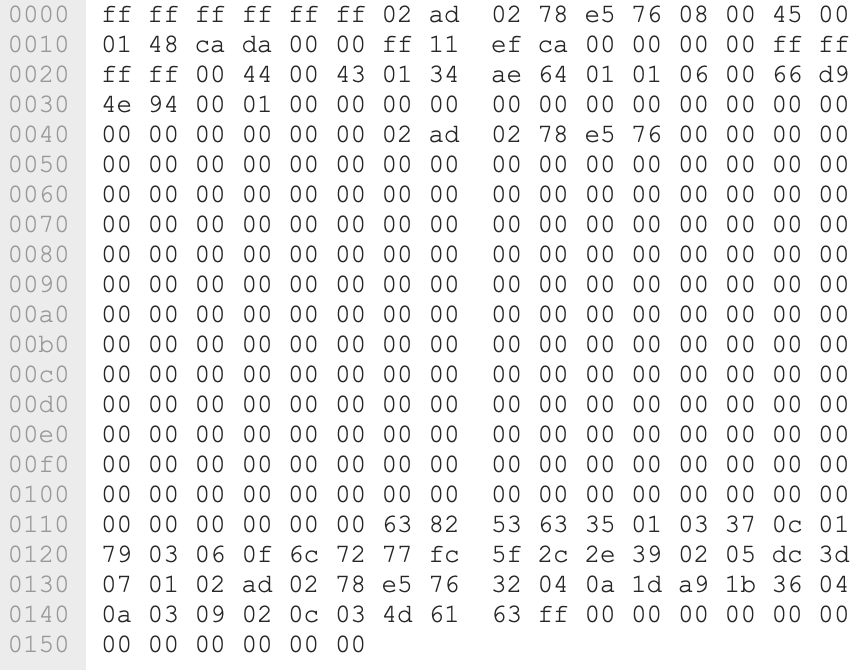

<center><strong>图 2.11 Request 包内容</strong></center>

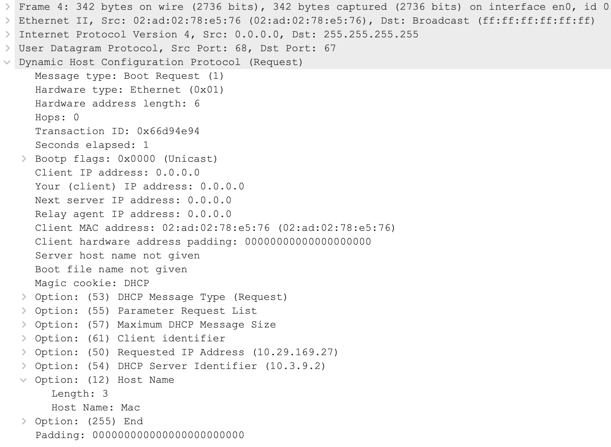

<center><strong>图 2.12 Request 包解析结果</strong></center>

​	我对部分较为重要的字段的内容进行了注释，如 表 2 - 4 所示：

<center><strong>表 2.4 Request 包字段注释</strong></center>

| 字段         | 值                             | 注释                                                       |
| ------------ | ------------------------------ | ---------------------------------------------------------- |
| Op           | 1                              | 客户端请求报文                                             |
| Htype        | 1                              | 以太网                                                     |
| Hlen         | 6                              | 以太网 MAC 地址长度                                        |
| Xid          | 0x66d94e94                     | 事件标识符，与之前一致                                     |
| Flags        | 0                              | 客户端请求服务器以单播形式发送响应报文                     |
| Ciaddr       | 0.0.0.0                        | 客户端尚未分配 IP 地址（未正式确认）                       |
| Yiaddr       | 0.0.0.0                        |                                                            |
| Siaddr       | 0.0.0.0                        |                                                            |
| Giaddr       | 0.0.0.0                        | 直接与 DHCP 服务器通信                                     |
| Chaddr       | 02:ad:02:78:e5:76              | 我的本机 MAC 地址                                          |
| Magic cookie | DHCP                           | 即 option 字段的前 4 字节                                  |
| Option(53)   | DHCP Request                   | 指明该数据包为 Request 请求                                |
| Option(55)   | 子网掩码、路由器、域名服务器等 | 请求参数列表                                               |
| Option(54)   | 10.3.9.2                       | DHCP Server 的 IP 地址                                     |
| Option(50)   | 10.29.169.27                   | 客户端请求使用的 IP 地址（客户端从服务器回复的 IP 中选择） |

​	Option(53) 指示了消息类型为 DHCP Request 。Xid（0x66d94e94）用于跟踪请求和响应，确保消息的正确匹配，与前面的报文一致。Option(50) 和 Option(54) 分别提供了服务器回复的 IP 地址 和 DHCP Server 的 IP 地址，Option(55) 列出了客户端请求的参数。这些信息帮助 DHCP 服务器确认客户端请求的配置。

​	当服务器收到 Request 报文后，如果确认无误，会回复一个 DHCP ACK 报文，用于正式分配 IP 地址和其他网络配置信息。其报文内容和解析结果如图 2.13 和图 2.14 所示。

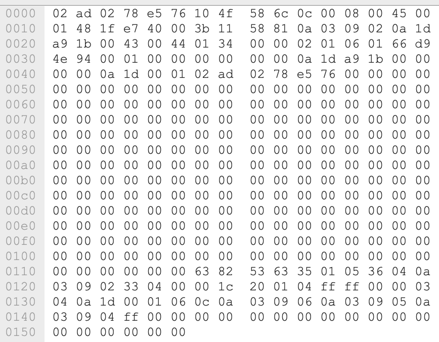

<center><strong>图 2.13 ACK 包内容</strong></center>

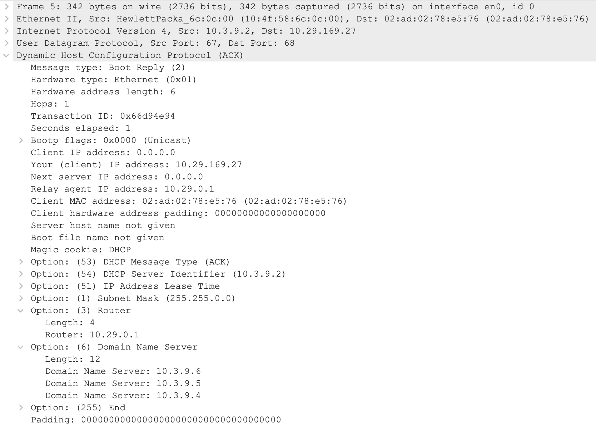

<center><strong>图 2.14 ACK 包解析结果</strong></center>

​	我对部分较为重要的字段的内容进行了注释，如 表 2 - 5 所示：

<center><strong>表 2.5 ACK 包字段注释</strong></center>

| 字段         | 值                | 注释                                                      |
| ------------ | ----------------- | --------------------------------------------------------- |
| Op           | 2                 | 服务端响应报文                                            |
| Htype        | 1                 | 以太网                                                    |
| Hlen         | 6                 | 以太网 MAC 地址长度                                       |
| Hops         | 1                 | 经过了 1 个 DHCP Relay                                    |
| Xid          | 0x66d94e94        | 事件标识符，与之前一致                                    |
| Flags        | 0                 | 服务器以单播形式发送响应报文                              |
| Ciaddr       | 0.0.0.0           | 客户端尚未分配 IP 地址（未正式分配）                      |
| Yiaddr       | 10.29.169.27      | 客户端请求并经服务端确认使用的 IP                         |
| Siaddr       | 0.0.0.0           |                                                           |
| Giaddr       | 10.29.0.1         | 说明 DHCP Server 与主机不在一个网段（网关 IP：10.29.0.1） |
| Chaddr       | 02:ad:02:78:e5:76 | 我的本机 MAC 地址                                         |
| Magic cookie | DHCP              | 即 option 字段的前 4 字节                                 |
| Option(53)   | DHCP ACK          | 指明该数据包为 ACK 响应                                   |
| Option(54)   | 10.3.9.2          | DHCP Server 的 IP 地址                                    |
| Option(51)   | 33 04 00 00 1c 20 | 租约期限（2小时）                                         |
| Option(1)    | 255.255.0.0       | 子网掩码（说明该网段为 B 类网络）                         |
| Option(3)    | 10.29.0.1         | 网关 IP                                                   |
| Option(6)    | 10.3.9.5等        | 可用的 DNS 服务器 IP                                      |

​	Option(53) 指示了消息类型为 DHCP ACK 。Xid（0x66d94e94）用于跟踪请求和响应，确保消息的正确匹配，与前面的报文一致。Yiaddr 提供了确认客户端使用的 IP 地址。Option(54) 提供了服务器的 IP 地址，Option(51) 提供了租赁期限，Option(1)、 Option(3) 和 Option(6) 分别提供了子网掩码、默认网关和 DNS 服务器的地址。这些信息将 IP 地址和其他网络配置信息正式分配给客户端使用，客户端通过配置其网络接口，以便能够正确地与其他网络设备通信。

#### DHCP 的通信过程综述

​	通过对捕获到的 DHCP 报文的详细分析，我使用 draw.io 绘制了 DHCP 服务器（服务端）和本机（客户端）的交互图如图 2 - 15 所示。

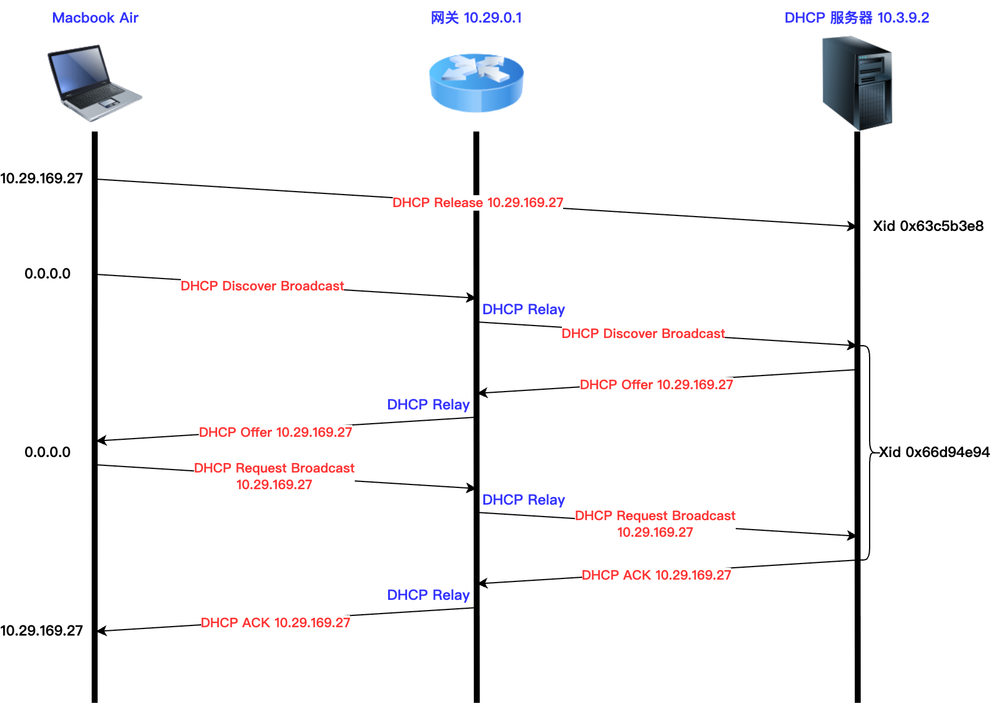

<center><strong>图 2.15 DHCP 网络交互图</strong></center>

​	值得注意的几点是：

1. DHCP  服务器的 Offer 和 ACK 并未采取广播的形式，而是通过将 MAC 地址设为客户端  MAC 的地址，转发给 10.29.0.1 子网， DHCP Relay 再将该报文转发给对应 MAC 地址的客户端。这是因为本机为了避免广播打扰其他主机，在发送的 DHCP 消息中请求服务器以单播回复。
2. 注意 Giaddr 字段，即第一个经过的 DHCP  Relay 的 IPv4 地址，对于客户端发出的 Discover 和 Request 包，两者均为 0.0.0.0，但是对于服务端发出的 Offer 和 ACK 包，其均为网关地址，并且跳数为 1，这说明客户端和服务器并不在一个网段（这点通过子网的网络地址和服务器的 IP 地址也可以判别）。客户端之所以填入 0.0.0.0，是因为在未分配 IP 地址的情况下，客户端并不知道网关，也无法跨网络传播报文，而 DHCP Relay 通过拦截该报文，将其转发给 DHCP Server 。

#### ARP 协议分析

##### 协议简介

​	ARP 协议用于解决从网络层的 IP 地址到数据链路层的 MAC 地址的映射关系问题^[4]^，常用于以太网通信中，数据报只知道目的节点的 IP 地址，但不知道 MAC 地址的情况（ IP 数据报文必须封装成帧才能在物理网络中传输）。其基本工作流程如下：

1. 假如网络层在发送某数据包时，没有在 ARP 缓存表中查到目的 IP 地址对应的 MAC 地址，那么在本网内广播一个 ARP 包，询问”某某 IP 地址的 MAC 地址是什么？“；
2. 对应 IP 地址的站点收到该广播包后，会回复自己的 MAC 地址信息给路由器（注意这里是单播）；

​	ARP 是在 DHCP 之后进行的，在 DHCP 分配好 IP 地址之后，才被用于：

- 检测该 IP 地址是否冲突（ARP Probe）；
- 通告网络中“我正在使用该 IP 地址”（ARP Announcement）；
- 解析网关或其他主机的 MAC 地址（ARP Request/Reply）；

#### ARP 报文格式

​	查阅资料并参考协议 [RFC 826](https://www.rfc-editor.org/rfc/rfc826) ，ARP 协议的报文格式定义如下：

```
+0--------------7--------------15----------------23----------------31
|                Ethernet Address of Destination(0-47)              |
+                                  +--------------------------------|
|                                  |                                |
+----------------------------------+                                |
|                Ethernet Address of Sender(0-47)                   |
+----------------------------------|--------------------------------|
|             Frame Type           |           Hardware Type        |
+----------------------------------|----------------|---------------|
|           Protocol Type          | Hardware Length|Protocol Length|
+----------------------------------|--------------------------------|
|              OP                  |                                |
+----------------------------------+                                |
|                Ethernet Address of Sender(0-47)                   |
+-------------------------------------------------------------------|
|                         IP Address of Sender                      |
+-------------------------------------------------------------------|
|                Ethernet Address of Destination(0-47)              |
+                                  +--------------------------------|
|                                  | IP Address of Destination(0-15)|
+----------------------------------|--------------------------------|
| IP Address of Destination(16-31) |
+----------------------------------|
```

​	各字段的含义如下：

**以太网帧头部**：

* **Ethernet Address of Destination**：目的 MAC 地址
  * 长度为 48 bits ；
  * 当发送 ARP Request 时，为广播的 MAC 地址，即 `ff ff ff ff` ；
* **Ethernet Address of Sender**：源 MAC 地址
  * 长度为 48 bits ；
* **Frame Type**：帧类型
  * 对于 ARP Request 和 ARP Reply ，该值为 0x0806 ；

**ARP 报文数据部分**：

* **Hardware Type**：硬件地址的类型
  * 对于以太网，该值为 1 ；
* **Protocol Type**：发送方要映射的协议地址类型
  * 对于 IPv4 协议，该值为 0x0800 ；
* **Hardware Length**：硬件地址的长度
  * 单位：Byte ；
  * 对于 ARP Request 和 ARP Reply ，该值为 6 ，即 48 bits ；
* **Protocol Length**：协议地址的长度
  * 单位：Byte ；
  * 对于 ARP Request 和 ARP Reply ，该值为 4 ；
* **OP**：操作类型
  * ARP Request：1 ；
  * ARP Reply：2 ；
  * RARP Request：3 ；
  * RARP Reply：4 ；
* **Ethernet Address of Sender**：发送方以太网地址
  * 这个字段和ARP报文首部的源以太网地址字段是重复信息，一般情况下是相同的；
  * 前者用于以太网传输；
  * 后者用于 IP - MAC 地址映射；
* **IP Address of Sender**：发送方的IP地址
  * 由源站，即发送方填写；
* **Ethernet Address of Destination**：接收方的以太网地址
  * 当发送 ARP Request 时，填充为 `00 00 00 00 00 00`；
* **IP Address of Destination**：接收方的IP地址

#### ARP 协议工作过程

​	我将结合我捕获到的 ARP 包简要解析 ARP 协议的工作流程。

##### ARP Probe 阶段（检测 IP 是否冲突）

​	首先，我的主机进行了 3 轮的发送 ARP Probe 包的操作，并且为 1 次广播 + 1 次单播。

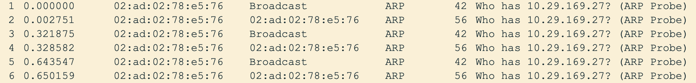

<center><strong>图 2.33 ARP Probe 阶段</strong></center>

**注**：

1. 查阅有关资料，多轮发送可能是 macOS 系统定义的冗余行为；
2. 发送给自己可能是用于本地校验？

​	以其中一个包为例，对 ARP Probe 包的关键字段进行详细分析如表 2. 15 所示：

<center><strong>表 2.15 ARP Probe 包字段注释</strong></center>

| 字段                            | 值                | 注释                                           |
| ------------------------------- | ----------------- | ---------------------------------------------- |
| Hardware Type                   | 1                 | 以太网                                         |
| Protocol Type                   | 0x0800            | IPv4 协议                                      |
| Hardware Length                 | 6                 | MAC 地址长为 6 字节                            |
| Protocol Length                 | 4                 | IP 地址长为 4 字节                             |
| OP                              | 1                 | 表示 ARP Request                               |
| Ethernet Address of Sender      | 02:ad:02:78:e5:76 | 我的本机 MAC 地址                              |
| IP Address of Sender            | 0.0.0.0           | 客户端尚未分配 IP 地址（结合前面的 DHCP 过程） |
| Ethernet Address of Destination | 0.0.0.0           | 填充内容                                       |
| IP Address of Destination       | 10.29.169.27      | 检测该地址是否会有其他主机回应，以此检测冲突   |

​	ARP Probe 是 ARP 协议的一种特殊用途形式，主要用于**设备在网络上确定 IP 地址是否已经被使用**，而不是为了获取某个 IP 的 MAC 地址。如果网络中有其他设备使用这个 IP 地址，就会进行回复，这样主机就能知道该 IP 地址是否会冲突。

##### ARP Announcement（主动声明 IP）

​	接下来，主机又发送了 3 次 ARP Annoucement 包，以其中一个包为例，对 ARP Announcement 包的关键字段进行详细分析如表 2. 16 所示：

<center><strong>表 2.16 ARP Annoucement 包字段注释</strong></center>

| 字段                            | 值                | 注释                                         |
| ------------------------------- | ----------------- | -------------------------------------------- |
| Ethernet Address of Destination | ff ff ff ff       | 在以太网上广播传输                           |
| Hardware Type                   | 1                 | 以太网                                       |
| Protocol Type                   | 0x0800            | IPv4 协议                                    |
| Hardware Length                 | 6                 | MAC 地址长为 6 字节                          |
| Protocol Length                 | 4                 | IP 地址长为 4 字节                           |
| OP                              | 1                 | 表示 ARP Request                             |
| Ethernet Address of Sender      | 02:ad:02:78:e5:76 | 我的本机 MAC 地址                            |
| IP Address of Sender            | 10.29.169.27      | 本机已经拿下该 IP 地址                       |
| Ethernet Address of Destination | 0.0.0.0           | 填充内容                                     |
| IP Address of Destination       | 10.29.169.27      | 检测该地址是否会有其他主机回应，以此检测冲突 |

​	 此过程用于向局域网内的其他站点声明，本设备的 IP 地址为 10.29.169.27 ，其他站点收到该信息后，能成功将该 IP 地址与 MAC 地址对应起来，并更新 ARP 缓存表。

##### ARP Request & Reply（准备访问网关）

​	接下来，主机又发送了 3 轮 ARP Request & Reply ，对 ARP Request & Reply 包的关键字段进行详细分析如表 2. 17 和 表 2 - 18 所示：

<center><strong>表 2.17 ARP Request 包字段注释</strong></center>

| 字段                            | 值                | 注释                |
| ------------------------------- | ----------------- | ------------------- |
| Ethernet Address of Destination | ff ff ff ff       | 在以太网上广播传输  |
| Hardware Type                   | 1                 | 以太网              |
| Protocol Type                   | 0x0800            | IPv4 协议           |
| Hardware Length                 | 6                 | MAC 地址长为 6 字节 |
| Protocol Length                 | 4                 | IP 地址长为 4 字节  |
| OP                              | 1                 | 表示 ARP Request    |
| Ethernet Address of Sender      | 02:ad:02:78:e5:76 | 我的本机 MAC 地址   |
| IP Address of Sender            | 10.29.169.27      | 本机 IP 地址        |
| Ethernet Address of Destination | 0.0.0.0           | 填充内容            |
| IP Address of Destination       | 10.29.0.1         | 网关 IP 地址        |

<center><strong>表 2.18 ARP Reply 包字段注释</strong></center>

| 字段                            | 值                | 注释                |
| ------------------------------- | ----------------- | ------------------- |
| Ethernet Address of Destination | 02:ad:02:78:e5:76 | 向本地 MAC 地址单播 |
| Hardware Type                   | 1                 | 以太网              |
| Protocol Type                   | 0x0800            | IPv4 协议           |
| Hardware Length                 | 6                 | MAC 地址长为 6 字节 |
| Protocol Length                 | 4                 | IP 地址长为 4 字节  |
| OP                              | 2                 | 表示 ARP Reply      |
| Ethernet Address of Sender      | 10:4f:58:6c:0c:00 | 网关的 MAC 地址     |
| IP Address of Sender            | 10.29.0.1         | 网关 IP 地址        |
| Ethernet Address of Destination | 02:ad:02:78:e5:76 | 我的本机 MAC 地址   |
| IP Address of Destination       | 10.29.169.27      | 本机 IP 地址        |

​	主机要发送数据出网（本次捕获中应该对应访问 DHCP Server ），就需要找网关（默认路由）。ARP Request 是由本机广播发送的，目的是为了找到 IP 地址为 10.29.0.1 ，即网关的 MAC 地址。发送者设备已经知道自己的 MAC 地址和 IP 地址，但它需要找到目标 IP 地址的 MAC 地址以便进行通信。通过广播这个请求，发送者希望网络上的所有设备都能收到这个请求，而目标 IP 地址对应的设备将会响应这个请求，提供其 MAC 地址。这样，发送者就可以更新其 ARP 缓存表，以便将来直接向目标设备发送以太网帧。

​	ARP Reply 是由 10.29.0.1 ，即网关在以太网上单播发送给我的主机，目的是响应之前收到的 ARP Request 。网关回应自己的 MAC 地址是 10:4f:58:6c:0c:00 。这样本机就可以收到这个回复，并更新其 ARP 缓存表，以便将来直接向查询设备发送以太网帧。

### 捕获和分析 ICMP 报文

#### 适配 macOS 系统的操作

​	ping 命令在 macOS 上的默认设置与 Windows 略有区别，Windows 上执行 `ping <host>` ，默认发送 4 次请求，而 macOS 上默认无限直至停止，需要指定参数，一些基本的参数配置如表 2.6 所示。

<center><strong>表 2.6 macOS 系统 ping 命令参数</strong></center>

| **参数**        | **作用说明**                                                 |
| --------------- | ------------------------------------------------------------ |
| -c <次数>       | 指定发送的请求次数（默认是无限直到停止）                     |
| -i <间隔秒数>   | 设置每次发送请求的间隔秒数（最小 0.2s，需 sudo 权限更小）    |
| -t <TTL值>      | 设置 IP 数据包的 TTL（生存时间）                             |
| -s <字节数>     | 设置 ICMP 数据包中数据部分的大小（默认56字节，即84字节总长度，但不能超过 MTU ） |
| -D              | 显示每次 ping 的时间戳（用于分析延迟波动）                   |
| -o              | 收到一个响应就退出（只关心连通性）                           |
| -q              | 安静模式，仅显示开始和汇总结果                               |
| -v              | 显示更详细的输出                                             |
| -W <超时时间秒> | 等待每次回复的最大时间（默认是无限）                         |
| -n              | 禁用主机名解析，仅显示 IP 地址                               |
| -b              | 允许 ping 广播地址（需管理员权限）                           |

#### 捕获方法及过程

1. **设置捕获条件**：在捕获过滤器中进行如下设置：`imcp`；
2. **开始捕获**：按下左上角的 `Start Capturing packets` 清空捕获记录并重新开始捕获；
3. **执行 ping 命令**：使用 iTerm2 终端，执行  `ping -c 4 www.bupt.edu.cn` ，进行连通性测试；

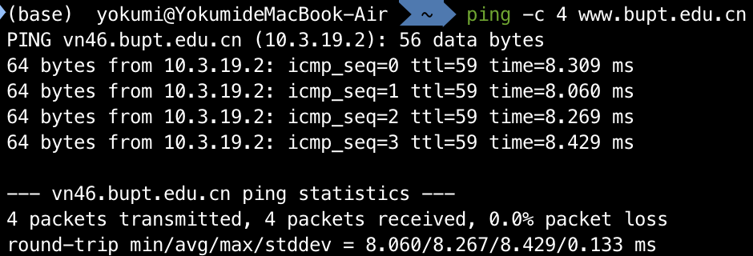

<center><strong>图 2.16 连通性测试</strong></center>

4. 观察 Wireshark，捕获到以下数据包：

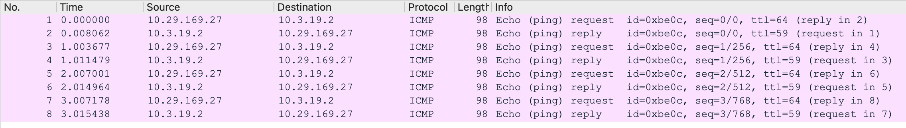

<center><strong>图 2.17  捕获到的 ICMP 消息</strong></center>

5. **保存捕获内容**：选中 8 条消息，保存至 `icmp.pcapng` ；

#### ICMP 协议分析

##### 协议简介

​	ICMP 协议，全称 Internet Control Message Protocol ，即互联网控制消息协议^[3]^。ICMP 是 IP 协议族的一部分，用于传递网络中的控制消息和错误报告，并不是用来传输用户数据的协议。该协议工作在**网络层**。

##### ICMP 报文格式

​	ICMP  报文有以下几种类型，如图 2 - 18 所示：

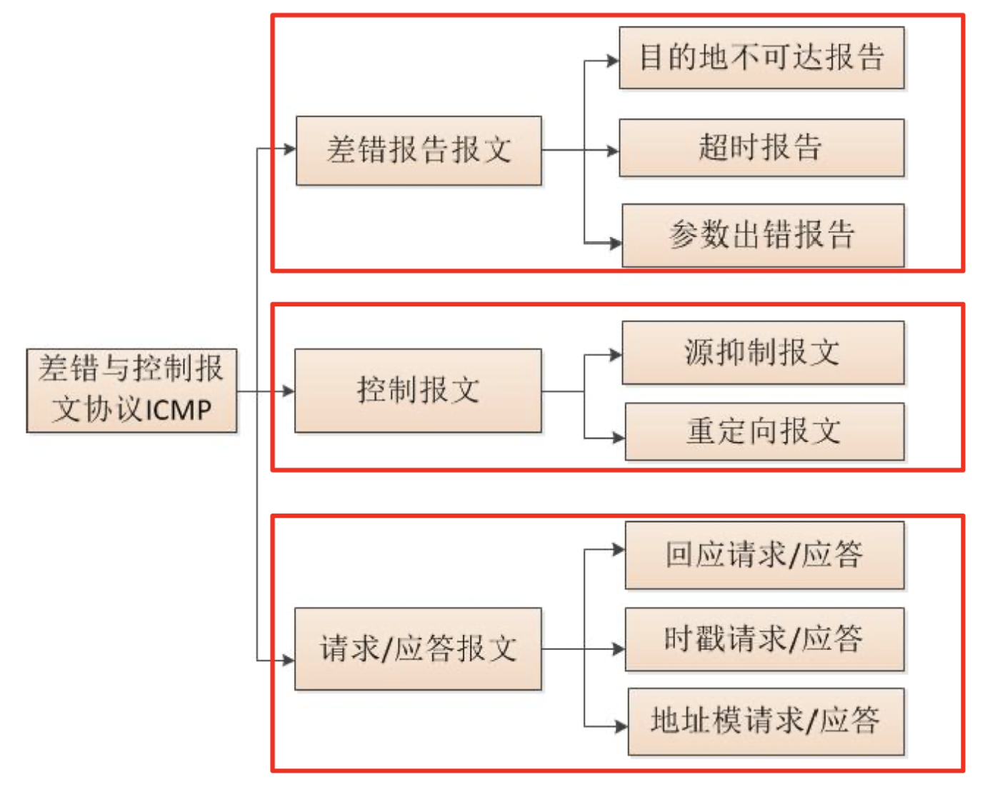

<center><strong>图 2.18 ICMP 报文类型</strong></center>

​	参考资料^[2]^ 和标准 [RFC 792](https://www.rfc-editor.org/rfc/rfc792)，其报文格式如下：

```
+0------7-------15---------------31
|  Type | Code  |    Checksum    |
+--------------------------------+
|          Message Body          |
|        (Variable length)       |
+--------------------------------+
```

​	由于事件较多，我们仅介绍几种常用的事件，

<center><strong>表 2.7 ICMP 报文类型字段含义</strong></center>

| **Type** | Code    | **名称**                | **用途说明**                                             |
| -------- | ------- | ----------------------- | -------------------------------------------------------- |
| 0        | 0       | Echo Reply              | 对应 ping 的响应                                         |
| 3        | 0 ～ 15 | Destination Unreachable | 通知目标不可达（包括网络、主机、端口、协议等不可达情况） |
| 4        | 0       | Source Quench           | 源抑制，常用于流量控制或拥塞控制                         |
| 5        | 0 ～ 3  | Redirect                | 重定向，数据包被判断为错误地路由，建议路由器使用其他路径 |
| 8        | 0       | Echo Request            | 对应 ping 的请求                                         |
| 11       | 0 ～ 1  | Time Exceeded           | 路由超时，用于 traceroute                                |
| 12       | 0 ～ 1  | Parameter Problem       | 报文参数错误                                             |
| 13       | 0       | Timestamp Request       | 时间戳请求                                               |
| 14       | 0       | Timestamp Reply         | 时间戳应答                                               |

​	由于本实验为连通性测试，主要用到 Echo or Echo Reply Message ，所以我们对这部分的 Message Body 展开具体介绍。

```
0                   1                   2                   3
0 1 2 3 4 5 6 7 8 9 0 1 2 3 4 5 6 7 8 9 0 1 2 3 4 5 6 7 8 9 0 1
+-+-+-+-+-+-+-+-+-+-+-+-+-+-+-+-+-+-+-+-+-+-+-+-+-+-+-+-+-+-+-+-+
|     Type      |     Code      |          Checksum             |
+-+-+-+-+-+-+-+-+-+-+-+-+-+-+-+-+-+-+-+-+-+-+-+-+-+-+-+-+-+-+-+-+
|           Identifier          |        Sequence Number        |
+-+-+-+-+-+-+-+-+-+-+-+-+-+-+-+-+-+-+-+-+-+-+-+-+-+-+-+-+-+-+-+-+
|     Data ...
+-+-+-+-+-
```

​	剩余字段的内容作用如下：

* **Identifier**：标识符，发送端设置，用于匹配 Request 和 Reply ；
* **Sequence Number**：序列号，从 0 开始递增，用于检测丢包和排序；
* **Data**：数据部分，ping 通常用时间戳或填充字节做 RTT 测试或压力测试；

#### 捕获报文分析

​	我们共捕获到 8 个，即 4 对 Request 包 和 Reply 包，我们选取第一组为例进行分析。Request 包的内容和解析结果如图 2 - 19 和 图 2 - 20 所示。

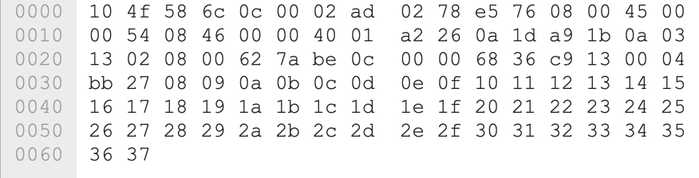

<center><strong>图 2.19 ICMP Request 包内容</strong></center>

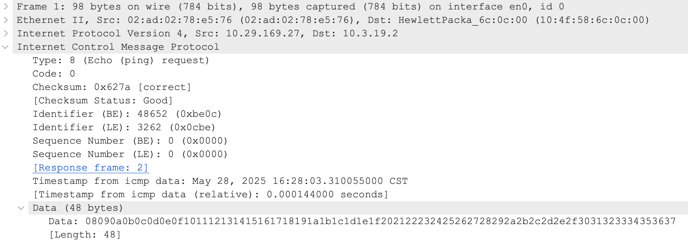

<center><strong>图 2.19 ICMP Request 包解析结果</strong></center>

​	我对部分较为重要的字段的内容进行了注释，如 表 2 - 8 所示：

<center><strong>表 2.8 ICMP Request 包字段注释</strong></center>

| 字段            | 值                   | 注释                              |
| --------------- | -------------------- | --------------------------------- |
| Type            | 8                    | 表示 Echo Request                 |
| Code            | 0                    |                                   |
| Checksum        | 0x627a               | 16 位校验码，校验成功             |
| Identifier      | 48652(BE) / 3262(LE) | 标识符，用于匹配 Request 和 Reply |
| Sequence Number | 0(BE) / 0(LE)        | 序列号，从  0 开始递增            |
| Data            | 略                   | ICMP 数据部分，共 48 Bytes        |

**注**：	

1. BE 和 LE ，即 Big Endian 和 Little Endian ，即整数的两种不同字节序。
2. Data 数据部分长度为 48 Bytes ，这是因为 macOS 系统中，ping 命令默认发送 56 Bytes ，其中 IMCP Header 共 8 Bytes ，Payload 部分 占 48 Bytes；

​	Reply 包的内容和解析结果如图 2 - 20 和 图 2 - 21 所示：

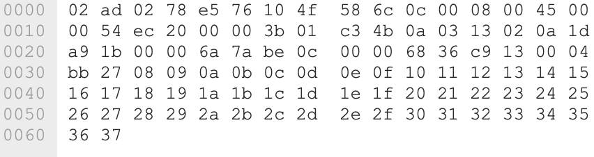

<center><strong>图 2.20 ICMP Reply 包内容</strong></center>

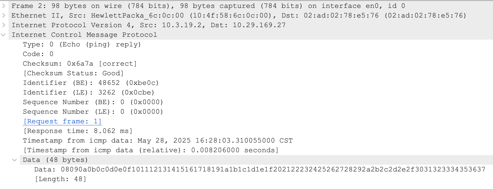

<center><strong>图 2.21 ICMP Reply 包解析结果</strong></center>

​	我对部分较为重要的字段的内容进行了注释，如 表 2 - 9 所示：

<center><strong>表 2.8 ICMP Reply 包字段注释</strong></center>

| 字段            | 值                   | 注释                              |
| --------------- | -------------------- | --------------------------------- |
| Type            | 0                    | 表示 Echo Reply                   |
| Code            | 0                    |                                   |
| Checksum        | 0x6a7a               | 16 位校验码，校验成功             |
| Identifier      | 48652(BE) / 3262(LE) | 标识符，用于匹配 Request 和 Reply |
| Sequence Number | 0(BE) / 0(LE)        | 序列号，从  0 开始递增            |
| Data            | 略                   | ICMP 数据部分，共 48 Bytes        |

​	Type 和 Code 字段共同表明该 Packet 为 Echo Request / Echo Reply 。每个 ping 程序启动时会生成一个唯一的 Identifier ，所以两者的 Identifier 匹配，用于区分多个 ping 实例或多个会话。每发送一个新的 Echo Request（可以通过后面的几组进行验证，后三组的 Sequence Number 分别为 1、2、3），Sequence Number + 1，并且同一组 Request 和 Reply 的 Sequence Number 也需要匹配。两者的 Data 字段也相同，方便检测链路中是否发生数据篡改或丢包。

### IP 包的分段功能的捕获和分析

#### 适配 macOS 系统的操作

​	macOS 下 ping 命令通过 `-s` 参数控制制作 IP 数据包的长度，Windows 系统下通过 `-l` 参数控制，但两者作用是一致的，并且都指定的是 **ICMP 数据报的数据部分大小**，不包括 ICMP Header 和 IP Header 。不过两者在显示上存在区别，Windows 终端输出结果形如 `Reply from 10.3.19.2: bytes=8000 ...` ，这里的 bytes=8000 指的是 ICMP 数据部分的大小，而 macOS 下的输出结果如图 2.22 所示，会显示 ICMP Header + ICMP Data 的长度。

#### 捕获方法及过程

1. **设置筛选条件**：在筛选器中进行如下设置：`ip.addr==10.3.19.2` ；其中 10.3.19.2 为 www.bupt.edu.cn 域名对应的 IP 地址；
1. **开始捕获**：按下左上角的 `Start Capturing packets` 清空捕获记录并重新开始捕获；
1. **执行 ping 命令**：使用 iTerm2 终端，执行  `ping -c 4 -s 8000 www.bupt.edu.cn` ，制作 8000 Bytes 的 IP 数据报并发送；

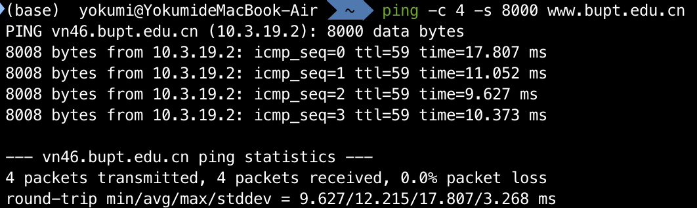

<center><strong>图 2.22 制作 IP 数据报并发送</strong></center>

4. 观察 Wireshark，捕获到以下数据包：

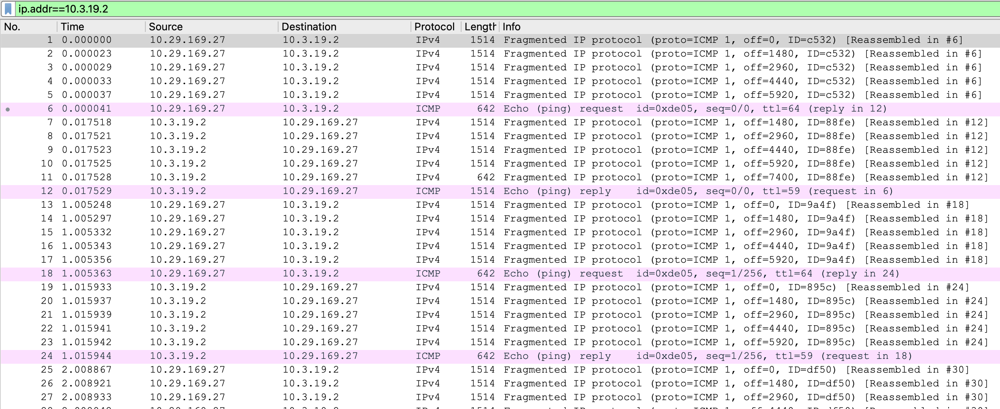

<center><strong>图 2.23 捕获到的 IP数据报</strong></center>

5. **保存捕获内容**：选中 48 条消息，保存至 `ipv4.pcapng` ；

#### IPv4 协议分析

​	根据教材，IPv4 的包头格式如图 2 - 24 所示。

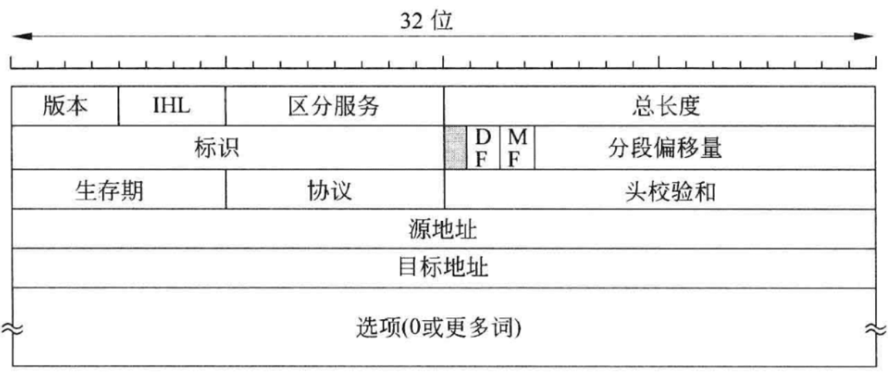

<center><strong>图 2.24 IPv4 包头格式</strong></center>

​	其中：

- **Version 版本**：数据报属于协议的哪个版本；
- **IHL(IP Header Length)**：IPv4 的头长度并不固定（体现在最后的 option 字段），IHL 为 4bits，规定表示范围为 5 ～ 15，对应的 IP Header 长度需要×4，即头长度范围为 20 ~ 60Bytes；
- **Type of Service 区分服务/服务类型**：共 8bits，前 6bits 表示数据报的服务类型，后 2bits 是 ECN 显式拥塞通知位；
- **Total Length 总长度**：头长度 + 数据字段长度；共 16bits，所以长度范围最大为 65535Bytes；
- **Identification 标识**：用于区分当前到达的分段属于哪个数据包；同一个数据包的所有分段的标识位相同；
- **DF(Don’t Fragment) 不分段标识**：告知路由器不要对该数据报进行分片；可以用在发现路径的 MTU 中；
- **MF(More Fragment) 更多的段标识**：告知路由器一个数据报的所有分段是否均到达；除了最后一个分段，其余分段 MF = 1；
- **Fragment Offset 分段偏移量**：该段在数据报中的位置，且必须是 **8 的整数倍**；注意只是数据部分，不包括首部；共 13 位，实际偏移量 = offset * 8；
- **Time to Live 生存期**：类似跳计数器；
- **Protocol Field 协议字段**：上层协议，即 TCP/UDP 等；
- **Checksum 头部检验和**：共 16 位，只对头部进行校验，不对数据进行校验；
- **Source IP Address 源地址**；
- **Destination IP Address 目标地址**；
- **Options 选项**：长度在 0 ～ 40Bytes，包括：
  - Security 安全性；
  - Strict source routing option 严格源选路：源节点指定路径，要求在每一跳中严格按照给出的完整路径传递数据报；
  - Loose source routing option 宽松源选路：源节点指定几个必须经过的路由器；
  - Record route option 记录路由：通知沿途的路由器将路由器的 IP 地址添加至选项字段区域；
  - The Timestamp option 时间戳；

​	关于其与实验捕获到的 IP 包的对应分析，见下一部分。

#### IP 分片过程分析

​	该部分，我们将结合捕获到的实际内容，验证理论分析。我们选取第 1 组，即 No.1 ~ 12 的 Packet 展开分析。由于 ICMP 协议中，Reply 和 Request 的数据部分匹配，所以我们通过 No.1 ~ 6 的 Packet 分析分片过程。

​	由捕获的内容可得，我们制作的 8000Bytes 的 IP 数据包被分为 6 片，我们依次分析每个分片的具体内容如下，对分片的内容和解析结果见图 2 - 25（由于篇幅限制，此处不一一展示每个分片的内容和解析结果），对每个分片字段的注释见表 2 - 9 ～ 表 2 - 14 。

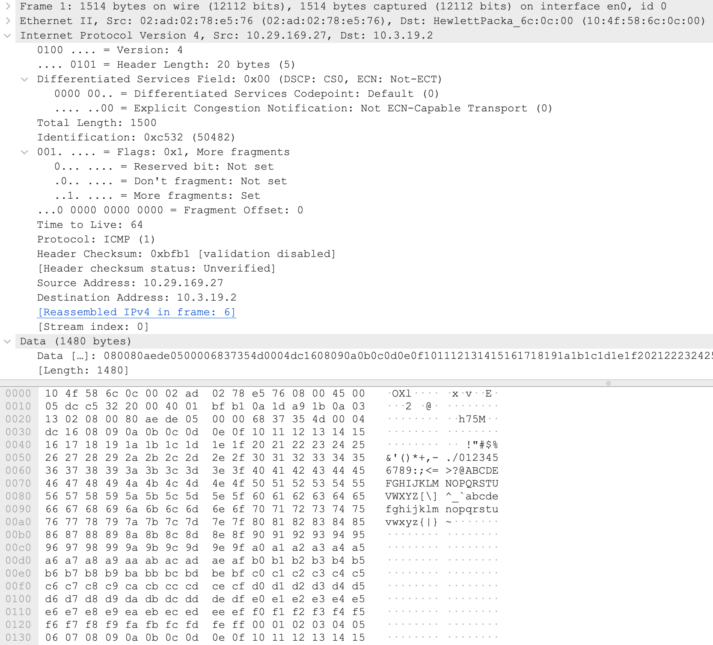

<center><strong>图 2.25 第一个分片的内容和解析结果</strong></center>

<center><strong>表 2.9 第一个分片字段注释</strong></center>

| 字段                   | 值           | 注释                                                         |
| ---------------------- | ------------ | ------------------------------------------------------------ |
| Version                | 4            | 表明为 IPv4 协议                                             |
| IHL                    | 5            | 即 IP Header 长度为 5 * 4 = 20 Bytes                         |
| Type of Service        | 0x00         | 后两位 Not-ECT ，说明网络未拥塞                              |
| Total Length           | 1500         | 头长度 + 数据字段长度，即数据字段长度 = 1500 - 20 = 1480 Bytes |
| Identification         | 0xc532       | 用于区分当前到达的分段属于哪个数据包                         |
| DF                     | 0            | 允许分片                                                     |
| MF                     | 1            | 当前分片不是最后一片                                         |
| Fragment Offset        | 0            | 该段在数据报中的位置                                         |
| Time to Live           | 64           | 每跳生存时间为 64 秒                                         |
| Protocol Field         | ICMP         | 携带数据来自 ICMP 协议                                       |
| Checksum               | 0xbfb1       | 头部校验和                                                   |
| Source IP Address      | 10.29.169.27 | 本机 IP                                                      |
| Destination IP Address | 10.3.19.2    | www.bupt.edu 域名对应的 IP 地址                              |
| Option                 | 无           | 无选项字段                                                   |
| Data                   | 略           | 数据字段共 1480 Bytes                                        |

​	以上以第一个分片为例，对 IPv4 Header 的格式进行了详细介绍，其余分片将省略一些和分片过程关系不大并且与第一个分片相同的字段。

<center><strong>表 2.10 第二个分片字段注释</strong></center>

| 字段            | 值     | 注释                                                         |
| --------------- | ------ | ------------------------------------------------------------ |
| Version         | 4      | 表明为 IPv4 协议                                             |
| IHL             | 5      | 即 IP Header 长度为 5 * 4 = 20 Bytes                         |
| Total Length    | 1500   | 头长度 + 数据字段长度，即数据字段长度 = 1500 - 20 = 1480 Bytes |
| Identification  | 0xc532 | 用于区分当前到达的分段属于哪个数据包                         |
| DF              | 0      | 允许分片                                                     |
| MF              | 1      | 当前分片不是最后一片                                         |
| Fragment Offset | 1480   | 该段在数据报中的位置（片中原比特表示对应 185 ，实际偏移量 = 185 * 8 = 1480） |
| Checksum        | 0xbef8 | 头部校验和                                                   |
| Option          | 无     | 无选项字段                                                   |
| Data            | 略     | 数据字段共 1480 Bytes                                        |

<center><strong>表 2.11 第三个分片字段注释</strong></center>

| 字段            | 值     | 注释                                                         |
| --------------- | ------ | ------------------------------------------------------------ |
| Version         | 4      | 表明为 IPv4 协议                                             |
| IHL             | 5      | 即 IP Header 长度为 5 * 4 = 20 Bytes                         |
| Total Length    | 1500   | 头长度 + 数据字段长度，即数据字段长度 = 1500 - 20 = 1480 Bytes |
| Identification  | 0xc532 | 用于区分当前到达的分段属于哪个数据包                         |
| DF              | 0      | 允许分片                                                     |
| MF              | 1      | 当前分片不是最后一片                                         |
| Fragment Offset | 2960   | 该段在数据报中的位置（片中原比特表示对应 370 ，实际偏移量 = 370 * 8 = 2960） |
| Checksum        | 0xbe3f | 头部校验和                                                   |
| Option          | 无     | 无选项字段                                                   |
| Data            | 略     | 数据字段共 1480 Bytes                                        |

<center><strong>表 2.12 第四个分片字段注释</strong></center>

| 字段            | 值     | 注释                                                         |
| --------------- | ------ | ------------------------------------------------------------ |
| Version         | 4      | 表明为 IPv4 协议                                             |
| IHL             | 5      | 即 IP Header 长度为 5 * 4 = 20 Bytes                         |
| Total Length    | 1500   | 头长度 + 数据字段长度，即数据字段长度 = 1500 - 20 = 1480 Bytes |
| Identification  | 0xc532 | 用于区分当前到达的分段属于哪个数据包                         |
| DF              | 0      | 允许分片                                                     |
| MF              | 1      | 当前分片不是最后一片                                         |
| Fragment Offset | 4440   | 该段在数据报中的位置（片中原比特表示对应 555 ，实际偏移量 = 555 * 8 = 4440） |
| Checksum        | 0xbd86 | 头部校验和                                                   |
| Option          | 无     | 无选项字段                                                   |
| Data            | 略     | 数据字段共 1480 Bytes                                        |

<center><strong>表 2.13 第五个分片字段注释</strong></center>

| 字段            | 值     | 注释                                                         |
| --------------- | ------ | ------------------------------------------------------------ |
| Version         | 4      | 表明为 IPv4 协议                                             |
| IHL             | 5      | 即 IP Header 长度为 5 * 4 = 20 Bytes                         |
| Total Length    | 1500   | 头长度 + 数据字段长度，即数据字段长度 = 1500 - 20 = 1480 Bytes |
| Identification  | 0xc532 | 用于区分当前到达的分段属于哪个数据包                         |
| DF              | 0      | 允许分片                                                     |
| MF              | 1      | 当前分片不是最后一片                                         |
| Fragment Offset | 5920   | 该段在数据报中的位置（片中原比特表示对应 740 ，实际偏移量 = 740 * 8 = 5920） |
| Checksum        | 0xbccd | 头部校验和                                                   |
| Option          | 无     | 无选项字段                                                   |
| Data            | 略     | 数据字段共 1480 Bytes                                        |

<center><strong>表 2.14 第六个分片字段注释</strong></center>

| 字段            | 值     | 注释                                                         |
| --------------- | ------ | ------------------------------------------------------------ |
| Version         | 4      | 表明为 IPv4 协议                                             |
| IHL             | 5      | 即 IP Header 长度为 5 * 4 = 20 Bytes                         |
| Total Length    | 628    | 头长度 + 数据字段长度，即数据字段长度 = 628 - 20 = 608 Bytes |
| Identification  | 0xc532 | 用于区分当前到达的分段属于哪个数据包                         |
| DF              | 0      | 允许分片                                                     |
| MF              | 0      | 当前分片是最后一片                                           |
| Fragment Offset | 7400   | 该段在数据报中的位置（片中原比特表示对应 925 ，实际偏移量 = 925 * 8 = 7400） |
| Checksum        | 0xdf7c | 头部校验和                                                   |
| Option          | 无     | 无选项字段                                                   |
| Data            | 略     | 数据字段共 1480 Bytes                                        |

​	在 Wireshark 中，最后一个到达的分片中能看到分片重组为 packet 的过程，如图 2 - 26 所示：

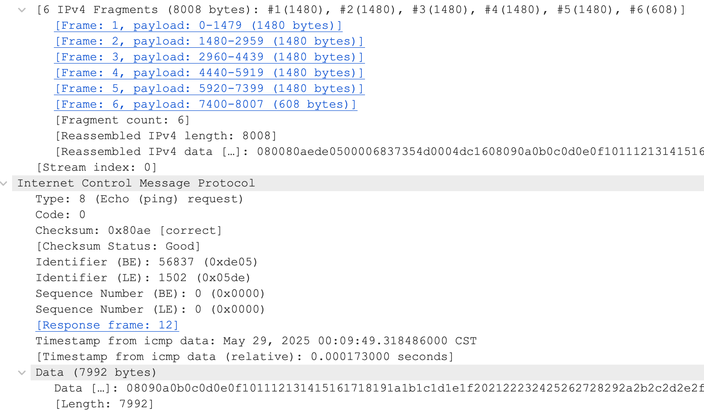

<center><strong>图 2.26 分片重组过程</strong></center>

​	汇总 IPv4 的分片过程如下：

```
+---------------+--------+--------+--------+--------+--------+--------+
|      No       |   1    |   2    |   3    |   4    |   5    |   6    |
+---------------+--------+--------+--------+--------+--------+--------+
| Header Length |                5(5 * 4 = 20 Bytes)                  |
+---------------+--------+--------+--------+--------+--------+--------+
| Total Length  |                    1500                    |  628   |
+---------------+--------+--------+--------+--------+--------+--------+
| Identification|                       0xc532                        |
+---------------+--------+--------+--------+--------+--------+--------+
|      DF       |                          0                          |
+---------------+--------+--------+--------+--------+--------+--------+
|      MF       |                     1                      |   0    |
+---------------+--------+--------+--------+--------+--------+--------+
|    Offset     |   0    |  1480  |  2960  |  4440  |  5920  |  7400  |
+---------------+--------+--------+--------+--------+--------+--------+
```

​	从捕获的内容可以看出，每个分片的 Identification 字段相同，标识符相同的分片即认为是同一组。DF 均为 0，表示允许分片，同时除最后一片外 MF = 1，表示还有更多的分片未到达，最后一片 MF = 0 。Offset 体现了当前分片在 IPv4 包中的数据部分的偏移量，通过偏移量可以确定每个分片在构造的 8000 Bytes 的数据报中的开始位置。

​	可以看到，6 个分片的 IPv4 Header 均没有选项字段，即 IP Header 长度均为 20 Bytes，除最后一个分片外，前 5 个分片的净荷长度均为 1500 - 20 = 1480 Bytes，最后 1 个分片的净荷长度为 628 - 20 = 628 Bytes。1480 * 5 + 628 = 8008 Bytes，即重组成为整个 ICMP 消息（数据部分 + ICMP 头长），并且校验通过，说明分片正确。

​	通过以上信息也可以得到链路的 MTU = 1500 Bytes，符合以太网的实际工作情况。

​	值得注意的一点是，Wireshark 的解析结果中，**ICMP Data 部分长度为 7992 Bytes** 。这是因为 Data 前还有一个长为 8 Bytes 的 **Timestamp 字段**，用于记录发出时间，为 ping 工具自动添加，和 Data 部分共同 ICMP Payload，即数据部分，不属于 ICMP Header ，只不过 Wireshark 将其单独解析出来了。

**注**：

​	在 IP Header 的解析结果，如图 2 - 25 中，会看到如下内容：

```
Header Checksum: 0xdf7c[validation disabled]
[Header checksum status: Unverified]
```

​	这说明该 Checksum 未验证，这是因为Wireshark 默认有些情况下不会主动验证 Checksum，我们是通过 **WIFI 接口抓取发送包**，所以属于默认情况之一。如果希望对 Checksum 进行验证，可以在 Wireshark 中的 `Preferences → Protocols → IPv4` 勾选 `Validate the IPv4 checksum if possible` ，如图 2 - 27 所示。


<center><strong>图 2.27 打开 Checksum 主动验证</strong></center>

​	然后，再次点击进入 packet ，可以发现解析结果变为：

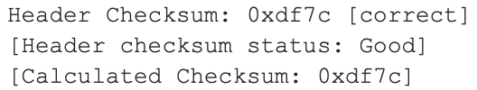

<center><strong>图 2.28 Checksum 主动验证显示结果</strong></center>

#### IP Header 的校验和的计算和检验

​	关于 IPv4 Header 的 Checksum 的计算，课上并没有具体展开讨论。参考教材和 标准 [RFC 791](https://www.rfc-editor.org/rfc/rfc791)，并通过上述捕获到的内容，对校验和进行计算和验证。

​	首先，Checksum 的计算过程，以第六个分片为例：

1. 将 IP Header 部分（20 Bytes）分为 10 组，即每 2 Bytes 一组：

`4500 0274 c532 039d 4001 df7c 0a1d a91b 0a03 1302`

2. 使用 1 的补码相加，注意计算时要将校验和字段本身置为 0：

`4500 + 0274 + c532 + 039d + 4001 + 0000 + 0a1d + a91b + 0a03 + 1302 = 0x2083`

3. 按位取反：

`0x2083 = 0010 0000 1000 0011`，按位取反得到 `1101 1111 0001 1100 = 0xdf7c` ；

​	我编写了如下 C 程序，模拟 Checksum 的计算过程：

```c
// 计算 IPv4 报文头部的校验和
uint16_t calculate_checksum(uint16_t *data, int length) {
    uint32_t sum = 0;

    for (int i = 0; i < length; i++) {
        sum += data[i];
        // 如果加和超过 16 位，就把高位加回来（模拟 one’s complement sum）
        if (sum > 0xFFFF) {
            sum = (sum & 0xFFFF) + 1;
        }
    }

    // 按位取反，得到最终校验和
    return ~sum & 0xFFFF;
}
```

​	对于校验过程，接收方应直接将所有组（包括校验和）进行相加，相加的结果应该为全 1，即 0xffff；同样对第六个分片进行验证，可以发现校验成功。

#### IPv6 协议分析

​	这里简单 ping 一个 IPv6 的包并对其进行分析。我选择对 BYRPT 进行连通性测试，具体捕获过程略。

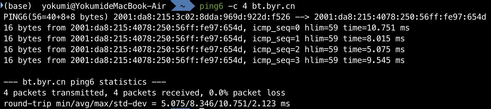

<center><strong>图 2.34 IPv6 协议下的连通性测试</strong></center>

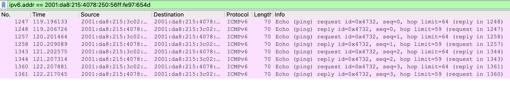

<center><strong>图 2.35 捕获的 IPv6 包</strong></center>

##### IPv6 报文格式

​	IPv6 的报文格式如下：

```
0                   1                   2                   3
0 1 2 3 4 5 6 7 8 9 0 1 2 3 4 5 6 7 8 9 0 1 2 3 4 5 6 7 8 9 0 1
+-+-+-+-+-+-+-+-+-+-+-+-+-+-+-+-+-+-+-+-+-+-+-+-+-+-+-+-+-+-+-+-+
|Version| Traffic Class |              Flow Label               |
+-+-+-+-+-+-+-+-+-+-+-+-+-+-+-+-+-+-+-+-+-+-+-+-+-+-+-+-+-+-+-+-+
|         Payload Length        |  Next Header  |   Hop Limit   |
+-+-+-+-+-+-+-+-+-+-+-+-+-+-+-+-+-+-+-+-+-+-+-+-+-+-+-+-+-+-+-+-+
|                                                               |
+                                                               +
|                                                               |
+                         Source Address                        +
|                                                               |
+                                                               +
|                                                               |
+-+-+-+-+-+-+-+-+-+-+-+-+-+-+-+-+-+-+-+-+-+-+-+-+-+-+-+-+-+-+-+-+
|                                                               |
+                                                               +
|                                                               |
+                      Destination Address                      +
|                                                               |
+                                                               +
|                                                               |
+-+-+-+-+-+-+-+-+-+-+-+-+-+-+-+-+-+-+-+-+-+-+-+-+-+-+-+-+-+-+-+-+
|                      Extension Headers                        |
+                         ... ...                               +
```

​	其中，字段的具体含义如下：

* **Version**：版本
  * IPv4 协议：4 ；
  * IPv6 协议：6 ;
* **Traffic Class**： 流量类别/区分服务
* **Flow Label**：流标签
  * 控制传输时占用的带宽和时延，仍处于试验过程；
* **Payload Length**：有效载荷长度
  * 除基本包头 40 Bytes 之外的字节数；
  * 即扩展包头 + 数据部分；
* **Next Header**：下一报头
  * 该字段指明了跟随在 IPv6 基本报头后的扩展报头的信息类型；
* **Hop Limit**：跳数限制
  * 该字段定义了IPv6数据包所能经过的最大跳数；
  * 和 IPv4 中的 TTL 字段非常相似；
* **Source/Destination Address**：源/目的地址
  * 相较于 IPv4 的 32 位地址，IPv6 的地址长度为 128 位，即 16Bytes ；
* **Extension Headers**：扩展头
  * IPv6 取消了 IPv4 报头中的 Option 字段，并引入了多种扩展报文头；

​	以第一个捕获到的包为例简要分析，如表 2 - 19 所示。

<center><strong>表 2.19 IPv6 包字段注释</strong></center>

| 字段           | 值                                    | 注释                                     |
| -------------- | ------------------------------------- | ---------------------------------------- |
| Version        | 6                                     | 表明为 IPv6 协议                         |
| Traffic Class  | 0x00                                  | 默认服务等级，未显式拥塞                 |
| Flow Label     | 0x60a00                               | 一个 IPv6 流的标识符，用于路由器优化转发 |
| Payload Length | 16                                    | 有效载荷长度，                           |
| Next Header    | 58                                    | 指明负载内容为 ICMPv6 报文               |
| Hop Limit      | 64                                    | 跳数限制为 64                            |
| Source Address | 2001:da8:215:3c02:8dda:969d:922d:f526 | 本机 IPv6 地址                           |
| Dest Address   | 2001:da8:215:4078:250:56ff:fe97:654d  | BYRPT 的 IPv6 地址                       |

​	该包头字段固定为 40 Bytes，有效载荷长度为 16 Bytes 。

### TCP 建立连接和释放连接的分析

#### 前言

​	这里有必要在记录具体的捕获过程之前先进行一些铺垫。

1. 首先，实验过程中，我发现如果通过浏览器直接访问网页，比如，当你在浏览器中输入 `https://www.bupt.edu.cn/` ，浏览器发起主页面的 HTTP 请求，分析返回的 HTML，同时并行发起多个子请求（包括 JS、CSS、图片等等），其可能涉及多个 TCP 连接，带来的结果就是 Wireshark 捕获到一堆 TCP 包，并且部分内容可能使用 TLS 加密（HTTPS 协议），看不到具体内容。总之，由于响应和请求全部在一起，即使用筛选器进行筛选，也不便于分析。
2. 由于你的笔记本可能同时存在多个网络进程，除了通过 `tcp` 进行筛选，最好还需要指定 IP 地址；
3. 在指定 IP 地址时，我在实验中遇到以下问题，如果用学校官网作为目标，macOS 遵循 [RFC 6724](https://www.rfc-editor.org/rfc/rfc6724)，其中定义了地址选择优先级，IPv6 通常会被优先选用（尤其在 DNS 返回 IPv6 和 IPv4 的情况下），而学校官网显然支持 IPv6 访问，并且校园网也是优先走 IPv6 流量的，macOS 系统上可以通过 `nslookup -query=AAAA <host>` 进行查询，如图 2 - 29 所示。


<center><strong>图 2.29 学校官网的域名解析</strong></center>


<center><strong>图 2.30 校园网 IPv6 测试</strong></center>

4. 当然，还有一种原因，是启用的 ~~代理软件~~ 打开了启用 IPv6 ；
5. 实验中，抓取 IPv6 包也没什么问题，毕竟捕获 TCP 包的过程不需要重点关注 IP 地址；
6. 由于电脑与 BYRPT 需要保持通信，所以我并不打算采用临时禁用 IPv6 的方式。而是采用 macOS 系统的 `curl` 命令参数 `-4` ，强制使用 IPv4 发其 GET 请求；
7. 极小概率情况下，即使通过参数强制使用 IPv4 发起请求，会出现如图 2 - 31 所示的情形。


<center><strong>图 2.31 一种“奇怪”的情形</strong></center>

​	可以看到，TCP 握手和挥手走的是 IPv4 流量，但 HTTP 请求走的是 IPv6 流量，在查阅资料后，发现协议 [RFC 6555](https://www.rfc-editor.org/rfc/rfc6555) ，即 **Happy Eyeballs（快乐眼球算法）**，简单来说，为提升速度体验，会同时尝试使用 IPv6 和 IPv4 建立连接，哪个先成功就先用哪个，上图的场景就是先完成 TCP 三次握手的优先生效（即 IPv4 连接先握手成功），但浏览器选择使用 IPv6 socket 发出 HTTP 请求。具体而言，由于我对 IPv6 协议也知之甚少，时间所限，留给以后的学习继续讨论。

#### 捕获方法及过程

​	基于前言的铺垫，我采用访问信息门户的图标而不是打开整个网页，因为其只涉及 1 个 TCP 握手和挥手的过程和 1 次 HTTP 请求，涉及少量数据交换。至于为什么不继续用 www.bupt.edu.cn 了，是因为学校官网并没有图标，当然 TCP 是能正常工作的，只不过 HTTP 响应为 404 Not Found ；

1. **设置筛选条件**：在筛选器中进行如下设置：`ip.addr == 10.3.55.84 and (tcp || http)` ；其中 10.3.55.84 为 my.bupt.edu.cn 域名对应的 IPv4 地址，用于筛选源地址和目的地址为该地址的 packet ，tcp 和 http 用于筛选对应协议；
2. **开始捕获**：按下左上角的 `Start Capturing packets` 清空捕获记录并重新开始捕获；
3. **发起请求**：使用 iTerm2 终端，执行  `curl -4 http://my.bupt.edu.cn/images/favicon.ico -o favicon.ico` ，发起 GET 请求；
4. 观察 Wireshark，捕获到以下数据包：


<center><strong>图 2.32 捕获到的 TCP 和 HTTP 包</strong></center>

5. **保存捕获内容**：选中上述消息，保存至 `tcp.pcapng` ；

#### TCP 协议分析

##### 协议简介

​	TCP 协议，全称 Transmission Control Protocol ，即传输控制协议^[5]^，**TCP 是一种面向连接、可靠的、基于字节流的传输层协议**，它确保两个主机之间传输的数据完整无误、顺序正确。

##### TCP 头部格式

​	TCP 的头部格式如下^[2]^：

```
0                   1                   2                   3
0 1 2 3 4 5 6 7 8 9 0 1 2 3 4 5 6 7 8 9 0 1 2 3 4 5 6 7 8 9 0 1
+-------------------------------+-------------------------------+
|          Source Port          |       Destination Port        |
+-------------------------------+-------------------------------+
|                        Sequence Number                        |
+---------------------------------------------------------------+
|                    Acknowledgment Number                      |
+-------+-------+-+-+-+-+-+-+-+-+-------------------------------+
|  Data |       |C|E|U|A|P|R|S|F|                               |
| Offset| Rsved |W|C|R|C|S|S|Y|I|         Window Size           |
|       |       |R|E|G|K|H|T|N|N|                               |
+-------+-----------+-+-+-+-+-+-+-------------------------------+
|           Checksum            |         Urgent Pointer        |
+-------------------------------+-------------------------------+
|                            Options                            |
+---------------------------------------------------------------+
|                             data                              |
+---------------------------------------------------------------+
```

​	其中，各字段的含义^[5]^如下：

* **Source/Dest Port**：源/目的端口
  * 标识哪个应用程序发送/接受；
* **Sequence Number**：当前报文序列号
  * TCP 为了保证不发生丢包，就给每个包一个序号，同时序号也保证了传送到接收端实体的包的按序接收；
  * 当建立连接时，即 SYN = 1 时，第一个 SYN 报文虽然不携带数据，它的序列号 seq = x，“占用”一个序列号（因此对方的 ACK 应答会是 ack = x + 1）；
  * 当 SYN = 0 时，即数据传输阶段，序号字段的值指的是本报文段所发送的数据的第一个字节的序号；
* **Acknowledgment Number**：期望收到的报文序号
  * 即已经正确收到的报文序号 + 1 ；
  * 注意与数据链路层的滑动窗口协议区分；
* **Data Offset**：数据字段在报文中的起始位置
* **Reserved**：保留字段
  * 必须都填 0 ；
* **CWR**：拥塞窗口减少标志
  * 用于告诉对方“我已响应拥塞通知，减少窗口”；
* **ECE**：ECN 回声标志
  * 用于告诉对方“我感知到你的路径上产生了拥塞”；
* **URG**：紧急指针有效标识
  * 它告诉系统此报文段中有紧急数据，应尽快传送（相当于高优先级的数据）；
* **ACK**：确认序号有效标识
  * 当 ACK = 1 时确认号字段才有效；
  * 当 ACK = 0 时，确认号无效；
* **PSH**：标识接收方应该尽快将这个报文段交给应用层
  * 接收到 PSH = 1 的 TCP 报文段，应尽快的交付接收应用进程，而不再等待整个缓存都填满了后再向上交付；
* **RST**：重建连接标识
  * 当 RST = 1时，表明 TCP 连接中出现严重错误（如由于主机崩溃或其他原因），必须释放连接，然后再重新建立连接；
* **SYN**：同步序号标识
  * 当 SYN = 1 时，表示这是一个连接请求或连接接受请求；
* **FIN**：发端完成发送任务标识
  * 当 FIN = 1 时，表明此报文段的发送端的数据已经发送完毕，并要求释放连接；
* **Window Size**：窗口大小
  * 用于 TCP 的流量控制，窗口起始于确认序号字段指明的值，这个值是接收端期望接收的字节数，即接受方的 Buffer 大小。窗口最大为 65535 Bytes ；
* **Checksum**：校验字段
  * 包括 TCP 首部和 TCP 数据，是一个强制性的字段；
  * 由发送端计算和存储，并由接收端进行验证；
  * 在计算检验和时，要在 TCP 报文段的前面加上 12 Bytes 的伪首部；
* **Urgent Pointer**：紧急指针
  * 只有当 URG = 1 时，紧急指针才有效；
  * TCP 的紧急方式是发送端向另一端发送紧急数据的一种方式；
  * 紧急指针指出在本报文段中紧急数据共有多少个字节（紧急数据放在本报文段数据的最前面）；
* **Options**：选项字段
  * MSS：最长报文段长度（Maximum Segment Size，只包含数据字段，不包括 TCP 首部），告诉对方 TCP “我的缓存所能接收的报文段的数据字段的最大长度是 MSS Bytes”；
  * No-Operation：空操作，一般用于填充对齐；
  * Window Scale：窗口扩大因子，3 Bytes ，其中一个字节表示偏移值 S ，新的窗口值等于 TCP 首部中的窗口位数增大到（16 + S），相当于把窗口值向左移动 S 位后获得实际的窗口大小；
  * SACK permitted：启用选择确认；
  * Timestamps：时间戳；

##### TCP 建立连接过程分析

​	建立连接过程包括捕获的 Frame 1 ～ 3 ，如图 2 - 36 所示，我们先对每个报文的内容进行分析，在分析其完整的工作流程。对每个报文的字段的详细注释见表 2 - 20 ～ 2 - 22 ；（原始字节流和解析结果由于篇幅显示此处就省略了，同时，字段内容只针对 TCP 报文内容进行分析）

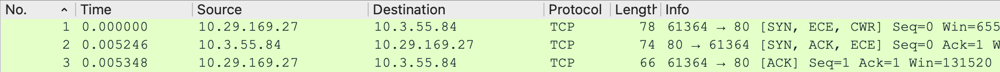

<center><strong>图 2.36 建立连接阶段的 TCP 包</strong></center>

<center><strong>表 2.20 TCP SYN 包字段注释</strong></center>

| 字段                   | 值             | 注释                                       |
| ---------------------- | -------------- | ------------------------------------------ |
| Source Port            | 61634          | 源端口                                     |
| Destination Port       | 80             | 目的端口，表示 HTTP 服务                   |
| Sequence Number        | 1627214260 / 0 | 序列号的原始内容 /相对序列号               |
| Acknowledgment Number  | 0              | 期望收到序号为 0 的字节，但其实无效        |
| Data Offset            | 44 Bytes       | 头部长度为 44 Bytes                        |
| CWR                    | 1              | 拥塞窗口减小                               |
| ECE                    | 1              | 拥塞                                       |
| URG/PSH/RST            | 0              | 并非紧急报文/不需要尽快交给应用层/连接正常 |
| ACK                    | 0              | 确认序号无效                               |
| SYN                    | 1              | 请求建立连接                               |
| FIN                    | 0              | 无需结束连接                               |
| Window Size            | 65535          | 客户端接收窗口大小                         |
| Checksum               | 0xb9e9         | 校验码                                     |
| Urgent Pointer         | 0              | 不是紧急情况                               |
| Option(MSS)            | 1460           | 最长报文段长度为 1460 Bytes                |
| Option(Window Scale)   | 6              |                                            |
| Option(SACK permitted) | 0x0402         | 允许选择确认                               |

**注**：

1. Wireshark 中 Sequence Number 字段解析结果如下：

```
Sequence Number: 0    (relative sequence number)
Sequence Number (raw): 1627214260
```

​	其中，relative sequence number 是 Wireshark 中“相对序列号”的显示方式，默认把第一个报文的序列号设为 0 ，后序报文的序列号也采用相对方式显示，`实际序列号（raw） - 初始序列号（ISN） = 相对序列号`；

​	如果不希望使用相对序列号，可以在 `Edit → Preferences → Protocols → 找到 TCP` ，去掉勾选 `Relative sequence numbers and window scaling`，点击 `Apply` 。

<center><strong>表 2.21 TCP SYN + ACK 包字段注释</strong></center>

| 字段                   | 值             | 注释                                       |
| ---------------------- | -------------- | ------------------------------------------ |
| Source Port            | 80             | 源端口                                     |
| Destination Port       | 61634          | 目的端口                                   |
| Sequence Number        | 1263262619 / 0 | 原始 / 相对序列号                          |
| Acknowledgment Number  | 1627214261 / 1 | 原始确认序号 / 期望收到相对序号为 1 的字节 |
| Data Offset            | 40 Bytes       | 头部长度为 40 Bytes                        |
| ECE                    | 1              | 拥塞                                       |
| CWR/URG/PSH/RST/FIN    | 0              |                                            |
| ACK                    | 1              | 确认序号有效                               |
| SYN                    | 1              | 请求建立连接                               |
| Window Size            | 28960          | 服务器接收窗口大小为 28960 * 128 Bytes     |
| Checksum               | 0x3474         | 校验码                                     |
| Urgent Pointer         | 0              | 不是紧急情况                               |
| Option(MSS)            | 1382           | 最长报文段长度为1382 Bytes                 |
| Option(Window Scale)   | 7              |                                            |
| Option(SACK permitted) | 0x0402         | 允许选择确认                               |

<center><strong>表 2.22 TCP ACK 包字段注释</strong></center>

| 字段                    | 值             | 注释                                          |
| ----------------------- | -------------- | --------------------------------------------- |
| Source Port             | 61634          | 源端口                                        |
| Destination Port        | 80             | 目的端口                                      |
| Sequence Number         | 1627214261 / 1 | 原始 / 相对序列号                             |
| Acknowledgment Number   | 1263262620 / 1 | 原始 / 相对确认号                             |
| Data Offset             | 32 Bytes       | 头部长度为 32 Bytes                           |
| ECE/CWR/URG/PSH/RST/FIN | 0              |                                               |
| ACK                     | 1              | 确认序号有效                                  |
| SYN                     | 0              |                                               |
| Window Size             | 2055           | 客户端接收窗口大小为 2055 * 64 = 131520 Bytes |
| Checksum                | 0xcc45         | 校验码                                        |
| Urgent Pointer          | 0              | 不是紧急情况                                  |
| Option(No-Operation)    |                | 对齐用                                        |

​	上述 TCP  连接建立阶段可以总结为“三次握手”，即“本地发送 SYN 、服务端返回 SYN + ACK 、本地发送 ACK ”。具体来说：

1. **第一次握手（SYN）**： 客户端发送一个带有 SYN 标志的 TCP 段到服务器，希望建立一个新的连接。这个段包含一个初始序列号（ISN），  这是一个较大的随机值，用于防止 TCP 重放攻击等安全问题，同时用于标识客户端发送的数据的起始点；
2. **第二次握手（SYN + ACK）**：服务器接收到客户端的 SYN 请求后，发送一个带有 SYN 和 ACK 标志的 TCP 段作为响应。服务器在响应中包含它自己的初始序列号，同时也确认了客户端的初始序列号，将其加 1 作为确认号（上述捕获的包中，无论是相对确认号还是实际的确认号都验证了这一点。值得注意的是注意区分 TCP 协议和数据链路层中滑动窗口协议关于 ACK 字段的含义的差异）；
3. **第三次握手（ACK）**：客户端收到服务器的 SYN + ACK 响应后，发送一个带有 ACK 标志的 TCP 段作为确认。这个段确认了服务器的初始序列号，将其加 1 作为确认号；

​	值得注意的是，实际实验过程中，前 2 次握手，其 ECE 和 CWR 字段存在被置位的情况，并且该问题能稳定复现，这对只发送一个 GET 请求的情况是不太合理的，让我怀疑握手阶段的 ECE 标志是否真的因为网络拥塞 IP 包中的 ECN 被置位。在查阅了标准 [RFC 3168](https://www.rfc-editor.org/rfc/rfc3168) 后，这个问题得到了解决。

<center><strong>表 2.23 TCP 初始化过程</strong></center>

| **报文类型**                | **设置标志位** | **含义**                                    |
| --------------------------- | -------------- | ------------------------------------------- |
| **SYN**（客户端发起）       | ECE=1, CWR=1   | 表示“我支持 ECN”（**ECN-setup SYN**）       |
| **SYN + ACK**（服务器响应） | ECE=1, CWR=0   | 表示“我也支持 ECN”（**ECN-setup SYN-ACK**） |
| **ACK**（客户端确认）       | 无特殊要求     | 继续握手即可                                |

- 这是纯协商行为，不表示真的发生拥塞；
- 成功协商后，双方都可以在 IP 包中设置 ECT 位（表明可标记）；
- 后续数据包若被中间路由器检测为拥塞，会将 IP 头的 ECN 设置为 11；
- 接收方会在 TCP ACK 中设置 ECE = 1，通知发送方“我感知到你的路径中拥塞”；
- 发送方响应时设置 CWR = 1，并适当降低拥塞窗口；

​	标准中还强调了几个注意事项：

1. SYN 和 SYN-ACK 不能设置 ECT（即显式拥塞控制位为 01 或 10，可以通过捕获的 TCP 报文前的 IP Header 进行验证，两者的 ECN 均为 00 ）；
2. 若任意一方发送了非 ECN-setup SYN/SYN-ACK（即 ECE/CWR 任一为 0），则该连接不再使用 ECN；
3. 连接建立后任意一方都不能“反悔”，必须按照 ECN 协议行为进行处理。

**注**：上述过程在 macOS 系统下能完全印证协议标准，但似乎在 Windows 系统下，握手时并不会有协商过程。

​	可以画出建立连接过程的消息序列图如图 2 - 37 所示：


<center><strong>图 2.37 TCP 建立连接过程网络序列图</strong></center>

##### TCP 释放连接过程分析

​	一个标准的 TCP 释放连接的过程可以总结为“四次挥手”，即 “一端发送  FIN 、另一端返回  ACK 、另一端发送  FIN 、一端返回  ACK ”，具体过程如下：

1. **第一次挥手（FIN）**： 发起关闭连接的一方发送一个带有 FIN 标志的 TCP 段，表示它已经完成发送数据，并希望关闭到对方的方向的连接；
2. **第二次挥手（ACK）**： 接收方收到这个 FIN 包后，发送一个带有 ACK 标志的 TCP 段作为响应，确认收到了对方的 FIN 包。此时，发起方到接收方的连接被关闭，但接收方仍然可以发送数据给发起方；
3. **第三次挥手（FIN）**：  当接收方也完成数据发送后，它会发送一个带有 FIN 标志的 TCP 段，请求关闭到发起方的连接；
4. **第四次挥手（ACK）**： 发起方收到这个 FIN 包后，发送一个带有 ACK 标志的 TCP 段作为响应，确认收到了对方的 FIN 包。此时，接收方到发起方的连接也被关闭；

​	通过“四次挥手”，实现了双方有序、对称地断开连接，确保数据已经全部传输完成。

​	不过实验过程中，释放连接阶段，实际只捕获到了 3 次挥手，对应 Frame 12 ~ 14 ，如图 2 - 38 所示。


<center><strong>图 2.38 释放连接阶段的 TCP 包</strong></center>

​	具体原因将在后面一部分展开叙述，此处先对每个包的内容进行分析，见表 2 - 24 ～ 26 ：

<center><strong>表 2.24 TCP FIN 包字段注释</strong></center>

| 字段                  | 值       | 注释                                              |
| --------------------- | -------- | ------------------------------------------------- |
| Source Port           | 61634    | 源端口                                            |
| Destination Port      | 80       | 目的端口，表示 HTTP 服务                          |
| Sequence Number       | 119      | 相对序列号                                        |
| Acknowledgment Number | 4627     | 期望收到序号为 4627 的字节                        |
| Data Offset           | 32 Bytes | 头部长度为 32 Bytes                               |
| ACK                   | 1        | 确认序号有效                                      |
| FIN                   | 1        | 希望结束连接                                      |
| Window Size           | 2048     | 客户端接受接收窗口大小为 2048 * 64 = 131072 Bytes |
| Urgent Pointer        | 0        | 不是紧急情况                                      |

<center><strong>表 2.25 TCP FIN + ACK 包字段注释</strong></center>

| 字段                  | 值       | 注释                                          |
| --------------------- | -------- | --------------------------------------------- |
| Source Port           | 80       | 源端口                                        |
| Destination Port      | 61634    | 目的端口                                      |
| Sequence Number       | 4627     | 相对序列号                                    |
| Acknowledgment Number | 120      | 期望收到序号为 120 的字节                     |
| Data Offset           | 32 Bytes | 头部长度为 32 Bytes                           |
| ACK                   | 1        | 确认序号有效                                  |
| FIN                   | 1        | 希望结束连接                                  |
| Window Size           | 227      | 服务器接收窗口大小为 227 *  128 = 29056 Bytes |
| Urgent Pointer        | 0        | 不是紧急情况                                  |

<center><strong>表 2.26 TCP ACK 包字段注释</strong></center>

| 字段                  | 值       | 注释                                              |
| --------------------- | -------- | ------------------------------------------------- |
| Source Port           | 61634    | 源端口                                            |
| Destination Port      | 80       | 目的端口                                          |
| Sequence Number       | 120      | 相对序列号                                        |
| Acknowledgment Number | 4628     | 期望收到序号为 4628 的字节                        |
| Data Offset           | 32 Bytes | 头部长度为 32 Bytes                               |
| ACK                   | 1        | 确认序号有效                                      |
| FIN                   | 0        |                                                   |
| Window Size           | 2048     | 客户端接受接收窗口大小为 2048 * 64 = 131072 Bytes |
| Urgent Pointer        | 0        | 不是紧急情况                                      |

​	那么，实验中捕获到的“三次挥手”能否确保两端的连接均被正确关闭呢？

​	事实上，第 2 个包，即 TCP FIN + ACK 事实上是将第二次挥手和第三次挥手合并。第一步，客户端发送 TCP FIN ，请求关闭连接，这与“第一次挥手”一致；第二步，服务端收到 TCP FIN 后，发送 TCP FIN + ACK，其中 Acknowledgment Number  =120 （TCP FIN 的 Sequence Number + 1 = 120 ）且有效，相当于对客户端 FIN 包进行了确认，同时也发出了 FIN ，请求结束连接，所以这一步起到了第二次挥手 + 第三次挥手的等效作用；第三步，客户端收到服务端发送的 TCP FIN + ACK 后，知道服务端已经正确收到 FIN 请求，自己可以关闭连接，并发送 TCP ACK 确认服务端的 FIN 请求；服务端在收到 TCP ACK 后，通过 Acknowledgment Number = 服务端刚刚发送的 FIN 包的 Sequence Number + 1 = 4628 ，知道客户端已经确认中断连接，于是服务端也中断自己的连接。

​	综上，连接正常关闭，没有数据丢失或状态悬挂，只是报文合并了。关于出现这种情形的原因解释见 2.5.3.5 节。

​	以实验实际的结果为准，画出“三次挥手”的释放连接过程的消息序列图如图 2 - 39 所示：

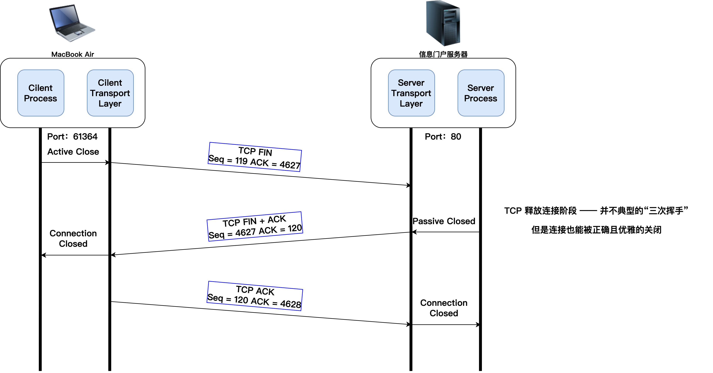

<center><strong>图 2.39 TCP 释放连接过程网络序列图</strong></center>

##### 为什么会出现 TCP 的三次挥手

​	显然，通过实验也验证了，TCP 是存在三次挥手的，那三次挥手有没有问题？什么情况下 TCP 会使用 3 次挥手？这引起了我的好奇，在查询有关资料后，发现这还曾经出现在面试八股中，接下来，我将结合网络资料^[6][7]^，并参考标准 [RFC793](https://www.rfc-editor.org/rfc/rfc793)，结合个人的理解进行分析。

​	从上述实验过程的分析可以发现，似乎第二次和第三次合并也不会有什么问题，那么为什么 TCP 协议还要规定“四次挥手”呢？

​	首先，需要明确，TCP 需要发送的数据包是由上层（应用层等）给它的，毕竟 TCP 协议是为应用层服务的，那么如果当服务器收到客户端的 TCP FIN 时，应用层有数据要发送呢？它立刻发送 ACK 给客户端显然没有问题，并且实际工作过程中，**内核确实是立刻回一个 ACK 应答报文**，因为客户端发出了 FIN 请求，说明客户端的应用层已经没有数据要发了。但是它如果将 FIN 一起发出去，应用层的数据不就不能发送了吗？所以，**对于要不要发 FIN 请求，决定权在应用层手上**。

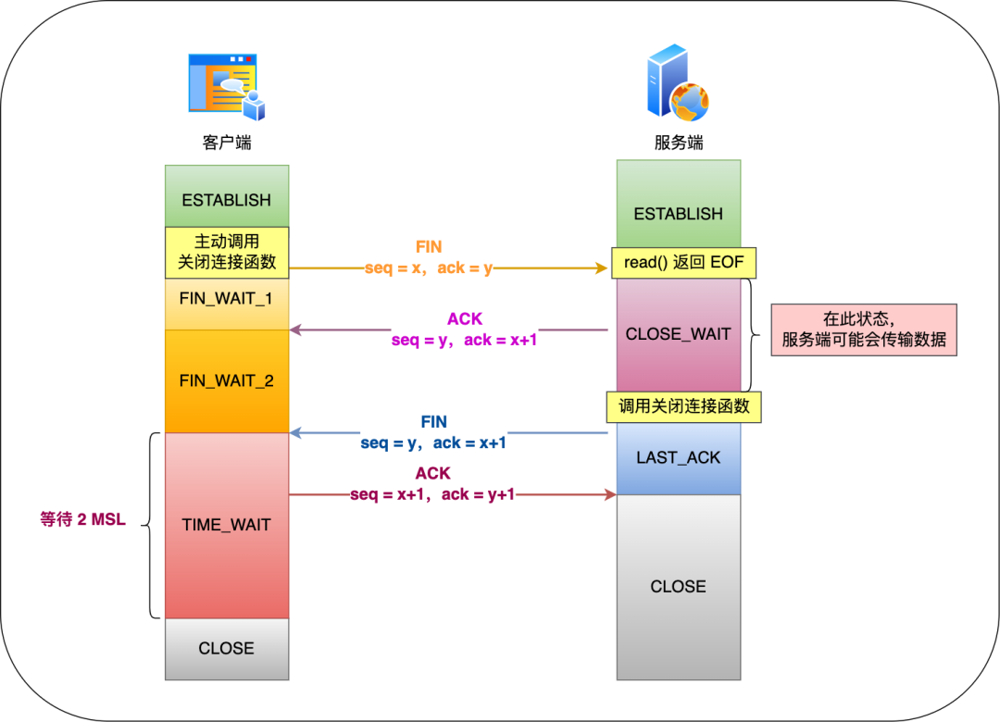

<center><strong>图 2.40 TCP 释放连接的“四次挥手”（图源：小林coding）</strong></center>

​	具体过程如下：

1. 客户端主动调用关闭连接的函数（还有一种情况，就是进程直接被关闭，无论是正常退出还是异常退出，内核都会发送 FIN），于是就会发送 FIN 报文，这个 FIN 报文代表客户端不会再发送数据，进入 `FIN_WAIT_1` 状态；
2. 服务端收到了 FIN 报文，内核马上回复一个 ACK 确认报文，此时服务端进入 `CLOSE_WAIT` 状态；同时，TCP 协议栈会为 FIN 包插入一个文件结束符 EOF 到接收缓冲区中，服务端应用程序可以通过  `read` 调用来感知这个 FIN 包，这个 EOF 会被放在已排队等候的其他已接收的数据之后，所以必须要得继续 read 接收缓冲区已接收的数据，确保应用层的数据都能被发送；
3. 接着，当服务端在 read 数据的时候，最后自然就会读到 EOF ，接着 `read()` 就会返回 0 ，这时服务端应用程序如果有数据要发送的话，就发完数据后才调用关闭连接的函数，如果服务端应用程序没有数据要发送的话，可以直接调用关闭连接的函数，这时服务端就会发一个 FIN 包，这个 FIN 报文代表服务端不会再发送数据了，之后处于 `LAST_ACK` 状态；
4. 客户端接收到服务端的 FIN 包,并发送 ACK 确认包给服务端，此时客户端将进入 `TIME_WAIT` 状态；
5. 服务端收到 ACK 确认包后,就进入了最后的 `CLOSE` 状态;
6. 客户端经过 2MSL 时间之后，也进入 `CLOSE` 状态;

​	关于关闭连接的函数，有 `close` 和 `shutdown` 两种，由于时间关系，此处不再展开叙述。

​	通过对“四次挥手”的分析，其实也可以直接思考为什么会出现“三次挥手”这一问题了，有且只有一种可能，ACK 没有立刻发送。这就是因为 TCP 协议默认的**延迟确认机制**（和滑动窗口协议中所说的捎带确认机制有些类似）。即，当发送没有携带数据的 ACK ，它的网络效率是很低的，因为它也需要封装上 40 个字节的 IP Header 和 TCP Header ，但本身短且没有携带数据报文。延迟确认机制采用如下策略：

* 如果有数据需要发送，则将 ACK 和 数据一起发送；
* 当没有数据需要发送时，ACK 会等待一段指定时间，如果这段时间内有数据需要发送，则一起发送；如果超时，那么才单独发送；

​	总结一下，**如果当被动关闭方在挥手过程中，应用层并无数据需要发送，且 TCP 默认开启了延迟确认机制，那么就会出现“三次握手”**；

​	对于我实验中的情况，显然 HTTP 请求已经相应完成并结束，无数据需要交换，所以出现了“三次握手”。

​	事实上，延迟确认时间定义在操作系统中，参考的网络资料对于 Linux 内核中的有关内容进行了详细的分析和实验，我将在以后的时间内进一步探索。

### TCP 数据通信过程的分析

#### TCP 的数据通信过程

​	本部分继续上一部分的内容，对捕获到的 Frame 4 ～ 11 的包展开分析，对应 TCP 数据通信的部分。对包的详细分析见表 2 - 27 ～ 2 - 

<center><strong>表 2.27 TCP HTTP包字段注释</strong></center>

| 字段                  | 值        | 注释                                                         |
| --------------------- | --------- | ------------------------------------------------------------ |
| Source Port           | 61634     | 源端口                                                       |
| Destination Port      | 80        | 目的端口                                                     |
| Sequence Number       | 1         | 相对序列号                                                   |
| Acknowledgment Number | 1         | 期望收到序号为 4628 的字节                                   |
| Data Offset           | 32 Bytes  | 头部长度为 32 Bytes                                          |
| Payload Length        | 118 Bytes | 这并不是 TCP 包中包括的字段，是通过 IP Header 间接运算得到的，具体见下 |
| ACK                   | 1         | 确认序号有效                                                 |
| PSH                   | 1         | 该包需要直接给应用层                                         |
| Window Size           | 2055      | 客户端接受接收窗口大小为 2055 * 64 = 131520 Bytes            |
| Urgent Pointer        | 0         | 不是紧急情况                                                 |

<center><strong>表 2.28 服务端 TCP ACK 包字段注释</strong></center>

| 字段                  | 值       | 注释                                                       |
| --------------------- | -------- | ---------------------------------------------------------- |
| Source Port           | 80       | 源端口                                                     |
| Destination Port      | 61634    | 目的端口                                                   |
| Sequence Number       | 1        | 相对序列号                                                 |
| Acknowledgment Number | 119      | 期望收到序号为119 的字节（118 + 1，对 Frame 4 进行了确认） |
| Data Offset           | 32 Bytes | 头部长度为 32 Bytes                                        |
| ACK                   | 1        | 确认序号有效                                               |
| Window Size           | 227      | 服务端接受接收窗口大小为 227 * 128 =  29056 Bytes          |
| Urgent Pointer        | 0        | 不是紧急情况                                               |

<center><strong>表 2.29 数据分片1 包字段注释</strong></center>

| 字段                  | 值         | 注释                                                       |
| --------------------- | ---------- | ---------------------------------------------------------- |
| Source Port           | 80         | 源端口                                                     |
| Destination Port      | 61634      | 目的端口                                                   |
| Sequence Number       | 1          | 相对序列号                                                 |
| Acknowledgment Number | 119        | 期望收到序号为119 的字节（118 + 1，对 Frame 4 进行了确认） |
| Data Offset           | 32 Bytes   | 头部长度为 32 Bytes                                        |
| Payload Length        | 1370 Bytes | 间接计算得出                                               |
| ACK                   | 1          | 确认序号有效                                               |
| Window Size           | 227        | 服务端接受接收窗口大小为 227 * 128 =  29056 Bytes          |
| Urgent Pointer        | 0          | 不是紧急情况                                               |

<center><strong>表 2.30 数据分片2 包字段注释</strong></center>

| 字段                  | 值         | 注释                                                       |
| --------------------- | ---------- | ---------------------------------------------------------- |
| Source Port           | 80         | 源端口                                                     |
| Destination Port      | 61634      | 目的端口                                                   |
| Sequence Number       | 1371       | 相对序列号（1370 + 1）                                     |
| Acknowledgment Number | 119        | 期望收到序号为119 的字节（118 + 1，对 Frame 4 进行了确认） |
| Data Offset           | 32 Bytes   | 头部长度为 32 Bytes                                        |
| Payload Length        | 1370 Bytes | 间接计算得出                                               |
| ACK                   | 1          | 确认序号有效                                               |
| Window Size           | 227        | 服务端接受接收窗口大小为 227 * 128 =  29056 Bytes          |
| Urgent Pointer        | 0          | 不是紧急情况                                               |

<center><strong>表 2.31 数据分片3 包字段注释</strong></center>

| 字段                  | 值         | 注释                                                       |
| --------------------- | ---------- | ---------------------------------------------------------- |
| Source Port           | 80         | 源端口                                                     |
| Destination Port      | 61634      | 目的端口                                                   |
| Sequence Number       | 2741       | 相对序列号（1371 + 1370 - 1 + 1）                          |
| Acknowledgment Number | 119        | 期望收到序号为119 的字节（118 + 1，对 Frame 4 进行了确认） |
| Data Offset           | 32 Bytes   | 头部长度为 32 Bytes                                        |
| Payload Length        | 1370 Bytes | 间接计算得出                                               |
| ACK                   | 1          | 确认序号有效                                               |
| Window Size           | 227        | 服务端接受接收窗口大小为 227 * 128 =  29056 Bytes          |
| Urgent Pointer        | 0          | 不是紧急情况                                               |

<center><strong>表 2.32 数据分片4 包字段注释</strong></center>

| 字段                  | 值        | 注释                                                       |
| --------------------- | --------- | ---------------------------------------------------------- |
| Source Port           | 80        | 源端口                                                     |
| Destination Port      | 61634     | 目的端口                                                   |
| Sequence Number       | 4111      | 相对序列号（2741+ 1370 - 1 + 1）                           |
| Acknowledgment Number | 119       | 期望收到序号为119 的字节（118 + 1，对 Frame 4 进行了确认） |
| Data Offset           | 32 Bytes  | 头部长度为 32 Bytes                                        |
| Payload Length        | 516 Bytes | 间接计算得出                                               |
| ACK                   | 1         | 确认序号有效                                               |
| PSH                   | 1         | 该包需要直接给应用层                                       |
| Window Size           | 227       | 服务端接受接收窗口大小为 227 * 128 =  29056 Bytes          |
| Urgent Pointer        | 0         | 不是紧急情况                                               |

<center><strong>表 2.33 客户端 TCP ACK 包字段注释</strong></center>

| 字段                  | 值       | 注释                                                         |
| --------------------- | -------- | ------------------------------------------------------------ |
| Source Port           | 61634    | 源端口                                                       |
| Destination Port      | 80       | 目的端口                                                     |
| Sequence Number       | 119      | 相对序列号                                                   |
| Acknowledgment Number | 4627     | 期望收到序号为 4627 的字节（4111 + 516 - 1 + 1，对服务端的响应进行了确认） |
| Data Offset           | 32 Bytes | 头部长度为 32 Bytes                                          |
| ACK                   | 1        | 确认序号有效                                                 |
| Window Size           | 1983     | 客户端接受接收窗口大小为 1983 * 64 =  126912 Bytes           |
| Urgent Pointer        | 0        | 不是紧急情况                                                 |

<center><strong>表 2.34 客户端 TCP Window Update 包字段注释</strong></center>

| 字段                  | 值       | 注释                                                         |
| --------------------- | -------- | ------------------------------------------------------------ |
| Source Port           | 61634    | 源端口                                                       |
| Destination Port      | 80       | 目的端口                                                     |
| Sequence Number       | 119      | 相对序列号                                                   |
| Acknowledgment Number | 4627     | 期望收到序号为 4627 的字节（4111 + 516 - 1 + 1，对服务端的响应进行了确认） |
| Data Offset           | 32 Bytes | 头部长度为 32 Bytes                                          |
| ACK                   | 1        | 确认序号有效                                                 |
| Window Size           | 2048     | 客户端接受接收窗口大小为 2048 * 64 =  131072 Bytes           |
| Urgent Pointer        | 0        | 不是紧急情况                                                 |

**注：关于 TCP 数据部分的长度计算**

​	虽然 TCP Header 中没有直接信息，但是可以通过 IP Header 中的信息可以间接计算出。

1. 首先需要理解封装的过程，TCP Header 和 TCP Data 部分都属于 IP Data 部分；
2. 以 HTTP 请求包为例，IP Header 中，Header Length = 20 Bytes，Total Length = 170 Bytes；
3. 所以 TCP Payload Length = Total Length - IP Header Length - TCP Header Length = 170 - 20 - 32 = 118 Bytes ；
4. 其余 TCP 包类似，此处不再赘述

​	结合捕获的包，可得实验过程中，TCP 的数据通信过程如下：

1. **客户端发送 GET 请求**：首先，客户端向服务器发出 GET 请求，并指示该包需要直接交给应用层处理；HTTP 请求在 TCP 的有效载荷，即数据部分，共 118 Bytes，具体内容将在下一节分析；
2. **服务端发送确认 ACK**：服务端收到请求后，回送一个 ACK ，其中 Acknowledgment Number = 119 ，说明服务器收到了 GET 请求的最后一个字节，即 118 + 1 ；
3. **服务端分片发送 HTTP 响应**：服务端对客户端发回 favicon 图标内容，由于其大小超出 MSS 限制，所以拆分为多个 TCP 包进行发送，分片过程如下：

```
+---------------------+--------+--------+--------+---------+
|         No          |   6    |   7    |   8    |    9    |
+---------------------+--------+--------+--------+---------+
|    Data Offset      |             32 Bytes               |
+---------------------+--------+--------+--------+---------+
|   Payload Length    |         1370 Bytes       |516 Bytes|
+---------------------+--------+--------+--------+---------+
|   Sequence Number   |   1    |  1371  |  2741  |  4111   |    
+---------------------+--------+--------+--------+---------+
|Acknowledgment Number|                119                 |
+---------------------+--------+--------+--------+---------+
```

​	最后一个包为  Reassembled PDU 的完成点，因此它展示了完整的 HTTP 响应；段中含 HTTP/1.1 200 OK 头部和 icon 数据尾部；

​	GET 响应的总数据量为 1370 * 3 + 516 = 4626 Bytes；

**注**：在建立连接部分，双方协商后，确定了服务端能发送的最大报文段长度为 1460 Bytes ；

​	但是又有一个问题，为什么不填满呢？这样利用效率不是最大吗？

​	事实上，如果填满，再加上 TCP Header 和 IP Header 后，会发现已经超过了以太网后 MTU = 1500 Bytes ，为避免这种情况，在发包时，服务端默认会预留点缓冲，避免链路层或驱动分片。给定的 MSS 只是上限。

4. **客户端发送确认 ACK**：客户端收到 HTTP 请求的响应内容，回送一个 ACK ，其中 Acknowledgment Number = 4627 ，说明客户端收到了 GET 响应的最后一个字节，即 4626 + 1 ；
5.  **客户端窗口更新**：客户端处理完 HTTP 响应内容后，释放 Buffer ，接收窗口从 126912 → 131072 扩大，表明其有能力继续接收数据，并通知服务端可以继续发更多数据；

​	可以画出 TCP 的数据通信阶段的网络交互图如图 2 - 41 所示：

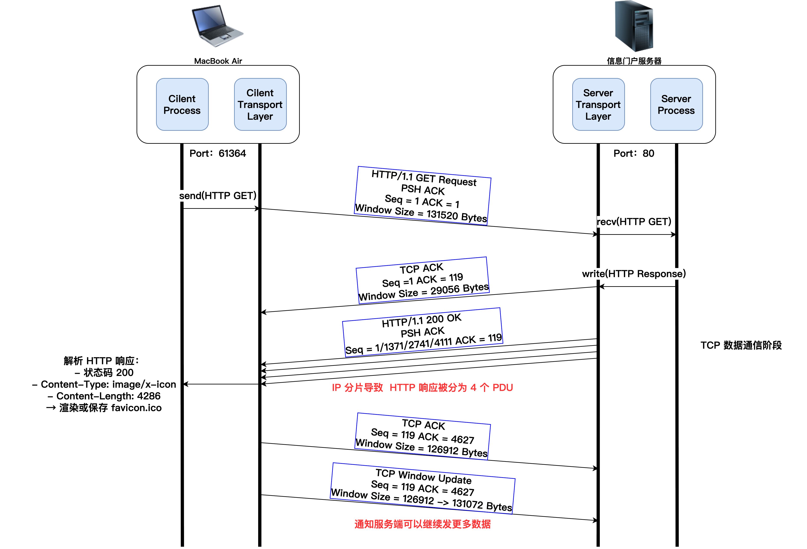

<center><strong>图 2.41 TCP 的数据通信阶段的网络交互图</strong></center>

#### HTTP 协议分析

​	此处对 HTTP 协议的分析较为简单，仅结合捕获的包对主要内容进行分析。

##### 协议简介

​	HTTP 协议^[8]^，全称 HyperText Transfer Protocol ，即超文本传输协议，HTTP是一个客户端和服务端（网站）之间请求和应答的标准，通常使用 TCP 协议。HTTP 协议中并没有规定它必须使用或它支持的层。事实上 HTTP 可以在任何互联网协议或其他网络上实现。HTTP 假定其下层协议提供可靠的传输。因此，任何能够提供这种保证的协议都可以被其使用，所以其在 TCP/IP 协议族使用 TCP 作为其传输层。

​	实验中，我们使用了其中的一种方法，即 GET ，向指定资源，即信息门户官网的图标文件资源发起请求。

##### HTTP 请求内容

​	HTTP 请求内容被放在 TCP 报文中的 Payload 部分，实验中，我们捕获到的内容如图 2 - 42 所示：


<center><strong>图 2.42 HTTP 请求内容</strong></center>

​	从中可以得到以下信息：

* **请求行**：`GET /images/favicon.ico HTTP/1.1\r\n`
  * 告诉服务器你要获取网站的这个路径上的图标资源 favicon.ico，使用的 HTTP 方法是 GET，协议版本是 HTTP/1.1 ；
* **请求头**：提供了
  * 请求的主机名 my.bupt.edu.cn ；
  * 用户代理信息（表明请求是由 `curl` 指令发出的）；
  * 可接受的编码类型（ gzip ）；

##### HTTP 响应内容

​	HTTP 响应内容同样被放在 TCP 报文中的 Payload 部分，不过传输过程中进行了分片。实验中，我们捕获到的内容如图 2 - 43 所示：

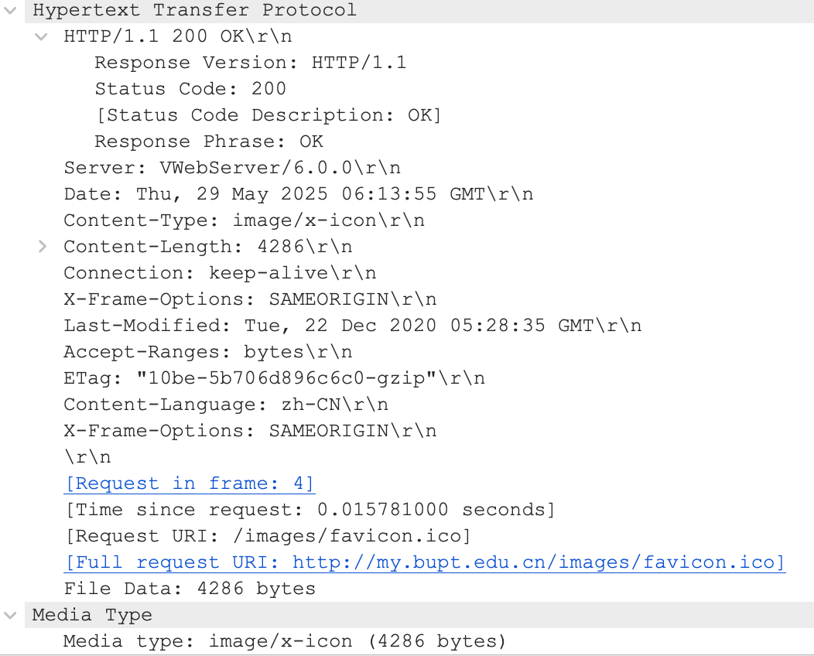

<center><strong>图 2.43 HTTP 响应内容</strong></center>

​	从中可以得到以下信息：

* **状态行**：`HTTP/1.1 200 OK`
  * 表示请求成功；
* **响应头**：包括 Server, Content-Type, Content-Length 等；
  * 描述响应内容的信息；
* **空行**：`\r\n`
  * 标志响应头结束；
* **实体内容**：
  * 4286 bytes 的 favicon.ico 图标数据，即发送给数据端的图标文件内容；

​	客户端下载的图标文件如图 2 - 44 所示：


<center><strong>图 2.44 下载的图标文件</strong></center>

## 实验总结

### 实验用时

​	该实验如果是完成给定的内容，其实只需 2 ～ 3 小时左右，但基于我在实验过程中对实际工作情况下产生的一些问题的兴致，后续有进行了长时间的探索，让本就不充裕的期末复习时间雪上加霜。

### 遇到的问题及解决方案

​	我对于实验每一步自己遇到的、可能遇到的问题都给出了详细的描述和相应的解决方案，并体现在正文实验步骤部分。同时给出了在 macOS 系统下进行实验的完整适配操作，并说明了一些操作系统层面上的区别。

### 实验心得与体会

​	实验之初，最开始感受到的是 Wireshark 软件的强大。在实验过程中，其实本身完成抓包，并按照课本上的内容进行分析，难度并不大。不过我对一些偶遇的问题产生了浓厚的兴趣，并对这些“细枝末节”展开了探索和研究。从对实验现象奇怪不解，到查询到有关标准的规定后大为震撼，耗时良久，但收获颇丰，发现课本的内容并非全部，实际场景中还有更多的细节，同时标准也在不断地更新和完善。

​	本次实验，大大加深了我对 DHCP 协议、UDP 协议、ARP 协议、IP 协议、TCP 协议以及 HTTP 协议的认识和理解，对它们的工作流程也有了更深入的了解。

​	计算机网络体系庞大，但其中的技术协议和软硬件，以及其与操作系统内核设计的关联，如此等等，保障其能正常有序的工作，我们所能探索的疆域绝无穷尽。

### 一些建议

​	这个实验本身难度并不大，实验指导书中建议的操作系统是 Windows 和 Linux ，我在实验中，针对 macOS 系统给出了详细的适配方案，可以更新到实验指导书中。另外实验指导书中也可以增加更多的探索部分。


**参考文献：**

[1] 维基百科编者. 动态主机设置协议[G/OL]. 维基百科, 2025(20250430)[2025-04-30]. https://zh.wikipedia.org/w/index.php?title=动态主机设置协议&oldid=87053495.

[2] 华为技术有限公司. IP 报文格式大全 [EB/OL]. https://support.huawei.com/enterprise/zh/doc/EDOC1100174722/2b689419, 2024-04-23.  

[3] 维基百科编者. 互联网控制消息协议[G/OL]. 维基百科, 2023(20230615)[2023-06-15]. https://zh.wikipedia.org/w/index.php?title=互联网控制消息协议&oldid=77689961.

[4] 维基百科编者. 地址解析协议[G/OL]. 维基百科, 2024(20240220)[2024-02-20]. https://zh.wikipedia.org/w/index.php?title=地址解析协议&oldid=81368618.

[5] 维基百科编者. 传输控制协议[G/OL]. 维基百科, 2024(20240508)[2024-05-08]. https://zh.wikipedia.org/w/index.php?title=传输控制协议&oldid=82562858.

[6] 小林coding, “TCP 四次挥手，可以变成三次吗？” 小林Coding. https://www.xiaolincoding.com/network/3_tcp/tcp_three_fin.html (访问日期: 2025年5月30日).

[7] zorro, “Linux的TCP实现之：四次挥手” zorro. https://zorrozou.github.io/docs/tcp/wavehand/TCP_Wavehand.html (访问日期: 2025年5月30日).

[8] 维基百科编者. 超文本传输协议[G/OL]. 维基百科, 2025(20250315)[2025-03-15]. https://zh.wikipedia.org/w/index.php?title=超文本传输协议&oldid=86451125.

​	一些互联网的 RFC 标准已经在正文部分给出引用及链接，此处不再罗列。


